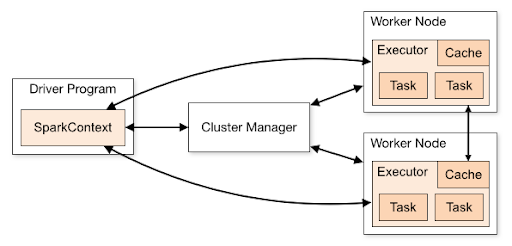

# Apache Spark
Apache Spark is an open-source unified analytics engine for large-scale data processing, employing underlying distributed compute.

<figure class="video-container">
    <iframe width="560" height="315" src="https://www.youtube.com/embed/Ud6luYCkkMk" title="YouTube video player" frameborder="0" allow="accelerometer; autoplay; clipboard-write; encrypted-media; gyroscope; picture-in-picture" allowfullscreen></iframe>
</figure>

## Spark Operations
In order to wrangle data in Spark, there are two types of Spark Operations:
* Transformations
* Actions

Transformations read a Spark DataFrame, reshapes the data, and eventually returns another DataFrame. Examples of a transformation functions include `filter`, `select`, and `union`. Transformation functions are **lazily** executed, meaning that Spark jobs are not executed no matter how many transformation functions are chained together.

Actions, on the other hand, are operations that write to disk (for example, `count`, `collect`, `take`) and are **eagerly** executed, meaning that once an action is declared, Spark runs it (and all other unexecuted transformations).

## Spark Cluster Topology

**Read:** [Overview of the Spark Cluster Topology](https://spark.apache.org/docs/latest/cluster-overview.html)

Working with a distributed system can be confusing to grasp.
* Very important that you understand the difference between driver and worker nodes
* Variables and data in your driver program are not automatically accessible/editable in your worker nodes
* Constants can be defined in a UDF ([User Defined Function (Bonus)](./udfs.mdx)) via [broadcast/accumulator (Bonus)](https://spark.apache.org/docs/2.2.0/rdd-programming-guide.html#broadcast-variables) variables

## Additional Resources (Bonus)
* [History of Spark](https://www.youtube.com/watch?v=p4PkA2huzVc) (first 3 minutes, skim the rest)
* [Overview of Spark (slides) by Brooke Wenig](https://brookewenig.com/SparkOverview.html#/)
* [Spark SQL Programming Guide (Python or Scala recommended)](http://spark.apache.org/docs/3.1.1/sql-getting-started.html)
* [DataFrame Methods](http://spark.apache.org/docs/3.1.1/api/python/reference/pyspark.sql.html#dataframe-apis) - e.g. df.someMethod()
* [Column Methods](http://spark.apache.org/docs/3.1.1/api/python/reference/pyspark.sql.html#column-apis) - e.g. F.col("myField").someMethod()
* [The different Data Types in Spark!](http://spark.apache.org/docs/3.1.1/api/python/reference/pyspark.sql.html#data-types)
* [The Sacred Texts](http://spark.apache.org/docs/3.1.1/api/python/reference/pyspark.sql.html#functions) - pyspark.sql.functions
* [Windows](http://spark.apache.org/docs/3.1.1/api/python/reference/pyspark.sql.html#window) - you’re going to want to read this carefully 😉
* [Campus PySpark & AWS + Spark Architectures](https://www.udemy.com/course/pyspark-aws-master-big-data-with-pyspark-and-aws/) (optional, when you have time)

