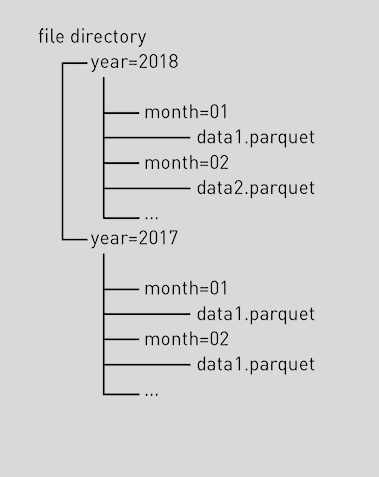
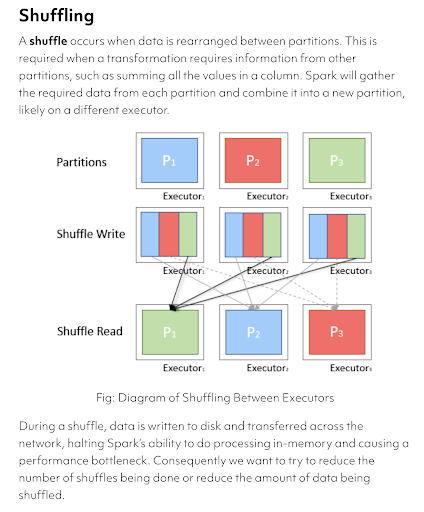

# Spark Workflow and Partitioning

<figure class="video-container">
    <iframe width="560" height="315" src="https://www.youtube.com/embed/rx-J34dKYUc" title="YouTube video player" frameborder="0" allow="accelerometer; autoplay; clipboard-write; encrypted-media; gyroscope; picture-in-picture" allowfullscreen></iframe>
</figure>

## Optimisation
At this point, we've wrangled/transformed our data...but how do we actually optimize our job’s performance?
**Golden Rule:** In the real world, make sure your dataset/table is partitioned well.
* Lots of small files are the enemy!
  * Having lots of tiny files will result in S3 needing to do lots of **file listing** operations. These are extremely slow and can even be expensive
  * Lots of small files means lots of data shuffling through the network. **This is slow!**
* **HUGE** files are also bad
  * Having too few files (all being huge) means you probably won’t take advantage of all of the cores in your cluster. In other words, the data can’t be easily distributed around the cluster
  * Each node in your cluster might even have to try and break down each of these huge files in order to redistribute some data to other nodes. This is a waste of time and money ([to emphasise the point](https://www.youtube.com/watch?v=982wFqC03v8&ab_channel=pyromaniack)). 

So what’s a suitable strategy?
  * There’s no "best" number. In parquet, try to target each `.snappy.parquet` file to be somewhere **roughly between 256MB to 1GB**
  * More importantly, make sure that you’re partitioning on columns that you frequently **filter** or do **groupBy** on (another reason to be Product-minded and ask your consumers what kinds of questions they'll need answered by your data)
  * **DO NOT** partition on columns with high cardinality (e.g. a userId, which has millions of distinct values)
  this will result in lots of **small files and lots of file listing operations**

## Partitioning

:::info

Partitioning strategy is the most important decision we have to get right!

:::

If your partitioning strategy is decent, you’ll most likely be fine and won’t need to tweak other knobs.
Especially going forward in the future with Spark 3.0’s [Adaptive Query Execution (AQE)](https://databricks.com/blog/2020/05/29/adaptive-query-execution-speeding-up-spark-sql-at-runtime.html), a lot of optimizations will be automated for you!

So how does a partitioned table look?
* It would actually look like a bunch of hierarchical folders
* The partitioning values become their own folder (e.g. year=2018)
* The underlying data will be at the bottom of the hierarchy and will
* often have a `.snappy.parquet` file extension (if using Spark and Parquet)

Can you give me an example?
* Partitioning the table based on some notion of time is a popular option
  (check if that makes sense for your consumers and your use case though!)
  * e.g. assuming each day of data for the table is of the order of 128MB - 1GB, then
    your partitioning keys can be (“year”, “month”, “day”)
* You don’t need to explicitly define all the values, Spark will smartly
  create a new partition for each distinct combination of your partitioning values

## Working with Partitioned Data

<figure class="video-container">
    <iframe width="560" height="315" src="https://www.youtube.com/embed/fhEJG2oFCm8" title="YouTube video player" frameborder="0" allow="accelerometer; autoplay; clipboard-write; encrypted-media; gyroscope; picture-in-picture" allowfullscreen></iframe>
</figure>

## Partitioning FAQs

 

So...is a parquet file a file or a folder of files?

Either!

* With a single-node library like [Pandas](https://pandas.pydata.org/), you can write a single `.snappy.parquet` file if you want
* In the real-world they are often folders of partitions
  * This way you can read/write an entire table with just one path (the root of the table)
    * e.g. `s3://my-bucket/my-table/` or `s3://my-bucket/my-table.parquet/` (both of these styles are still folders)
    * Underneath all the partitioning folders, you will find `.snappy.parquet` files
  * The query engine (e.g. Spark or Presto) will then take care of understanding the partitioning structure of the table and will optimize your queries around that
  * Spark will always write the output of a DataFrame as a folder at the root level rather than a single file (because it’s designed for distributed/concurrent reading/writing of data, which often involves multiple files)
  
## Shuffling

[Reference](https://blog.scottlogic.com/2018/03/22/apache-spark-performance.html#:~:text=A%20shuffle%20occurs%20when%20data,likely%20on%20a%20different%20executor.)

In general, another way to optimise for speed is to reduce shuffling, which can bottleneck performance as your data is merging all results back together. It's important to know which actions shuffle and which do not in the DataFrame API.

## Resources (Bonus)

* [Spark DAGs and planning](https://blog.rockthejvm.com/spark-dags/) (optional)
  * Just know that bad partitioning → shuffling → pain (must-watch)
  * You can check how ‘shuffly’ your Spark job looks by viewing the DAG
* [Managing Partitioning](https://mungingdata.com/apache-spark/partitionby/)
  * Important: understand that repartition() and DataFrame.write.partitionBy() are **not** the same thing
    * Repartition can take in 2 different types of arguments:
      * a number: controls the number of .snappy.parquet files
      * a bunch of column names: it will ensure 1 .snappy.parquet file per each distinct combination of your provided columns
    * DataFrame.write.partitionBy defines the folder structure of the table 
      * however, it does not guarantee how many .snappy.parquet files will be in each folder 
    * Sometimes you might even need to do both e.g. `df.repartition(“year”, “month”).write.partitionBy(“year”, ”month”)...` in order to guarantee exactly 1 .snappy.parquet file per each month folder
  * Try to read up on the difference between repartition and coalesce 
    * Short Answer: [The coalesce transformation applied to a DataFrame](https://spark.apache.org/docs/2.1.0/api/python/pyspark.sql.html#pyspark.sql.DataFrame.coalesce) (not to be confused with [coalesce() applied to a column](https://spark.apache.org/docs/latest/api/python//reference/pyspark.sql/api/pyspark.sql.functions.coalesce.html)), will try to merge partitions to reach your desired number. You only use coalesce when you want to reduce the number of partitions in your data.
    * On the other hand, repartition() will full shuffle all of the data around (more expensive).
    * If you need to increase the number of partitions in your data, then you will need repartition()
* [Practice Repartitioning vs PartitionBy in DataBricks](https://github.com/data-derp/small-exercises/blob/master/databricks-repartition-vs-write-partition-by.dbc)

