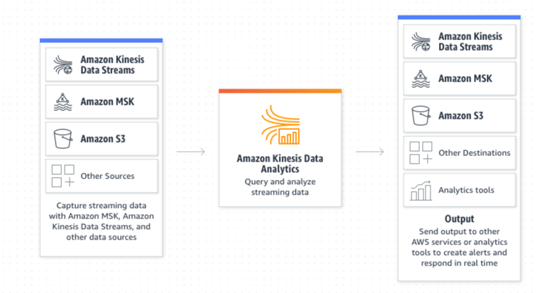

# Cloud Offerings: AWS

## Amazon Kinesis

<figure class="video-container">
    <iframe width="560" height="315" src="https://www.youtube.com/embed/07iZOEl0knc" title="YouTube video player" frameborder="0" allow="accelerometer; autoplay; clipboard-write; encrypted-media; gyroscope; picture-in-picture" allowfullscreen></iframe>
</figure>

[AWS Kinesis Overview (above)](https://aws.amazon.com/kinesis/) 

The four main categories are:
1. Kinesis Video Streams
2. Kinesis Data Stream 
3. Kinesis Data Firehose 
4. Kinesis Data Analytics

(2)-(4) are fairly standard to use in Data Processing and we'll deep dive into those below.

### Kinesis Data Stream

Kinesis Data Stream is an alternative to Kafka. It is essentially a message broker cluster that you can run your streaming and messaging services on.

<figure class="video-container">
    <iframe width="560" height="315" src="https://www.youtube.com/embed/hLLgkTUmwOU" title="YouTube video player" frameborder="0" allow="accelerometer; autoplay; clipboard-write; encrypted-media; gyroscope; picture-in-picture" allowfullscreen></iframe>
</figure>

[AWS Kinesis Data Stream Overview (above)](https://aws.amazon.com/kinesis/data-streams/)

### Kinesis Data Firehose
The main purpose of firehose is basically to connect to your Kinesis Cluster, capture the data, and load it into durable storage service (for example, S3 or a database).

[AWS Kinesis Data Firehose Overview (above)](https://aws.amazon.com/kinesis/data-firehose/)

### Kinesis Data Analytics

[AWS Kinesis Data Analytics Overview (above)](https://aws.amazon.com/kinesis/data-analytics/)

Up to now, with Kinesis Data Stream and Kinesis Data Firehose, we have pipes sending data from one point to another. [Kinesis Data Analytics](https://aws.amazon.com/kinesis/data-analytics/) helps develop applications that contain logic to either query or transform your data when it arrives through Kinesis Data Stream or Kinesis Data Firehose. 

<figure class="video-container">
    <iframe width="560" height="315" src="https://www.youtube.com/embed/SX_6x_wXIfA" title="YouTube video player" frameborder="0" allow="accelerometer; autoplay; clipboard-write; encrypted-media; gyroscope; picture-in-picture" allowfullscreen></iframe>
</figure>

You can use Kinesis Data Analytics in conjunction with the rest of the Kinesis ecosystem (and AWS would probably recommend that). But depending on your use case, you could technically use AWS Glue or Databricks to read from Kinesis and use the Spark Streaming API, whereas with Kinesis Data Analytics, it only supports Apache Flink and Beam using Flink Runners (Spark Streaming won't exist in the Kinesis service). If you really like Spark Streaming, it might be recommendable to pick another service that can connect to data streams.

There are benefits to using Kinesis Data Analytics (and Apache Flink), It’s designed to address continuous processing of data and it's a specialised framework to deal with streaming analytics. With Kinesis Data Analytics, you won't have to set up your own Flink cluster and all of the infrastructure for distributed systems; you can basically specify the amount of throughput units or the amount of data. The workflow might simply be to: specify the capacity that you want for Kinesis Data Analytics, submit your Flink logic as a jar, and it’ll run it for you.

### Reflection
**Question:** Why might you want to run a service such as Kinesis Data Analytics over building your own Kubernetes Cluster with Flink? 

> Maintenance overhead. It’s expensive and it could be painful to upgrade the version of Flink. Cloud offerings or other platforms might be more easily maintainable. An example of a platforms might be [Ververica](https://www.ververica.com/), which was developed by the creators of Flink. Simply create a job and you can submit, stop, or cancel it. Additionally, Kinesis handles the persistence of state - anything that needs some advanced data wrangling and advanced data processing will often need state. State needs to be managed very carefully (it can get really big and perhaps Kinesis will be a bit smarter than you when it comes to managing that state and making sure that your cluster didn’t blow up). Anything that is not bespoke to your application and business logic, try to offload that to infrastructure vendors or cloud services.

### Putting it all together: IoT

<figure class="video-container">
    <iframe width="560" height="315" src="https://www.youtube.com/embed/uWUAcc68MWI" title="YouTube video player" frameborder="0" allow="accelerometer; autoplay; clipboard-write; encrypted-media; gyroscope; picture-in-picture" allowfullscreen></iframe>
</figure>

## Amazon MSK
[Amazon Managed Streaming for Apache Kafka (Amazon MSK)](https://aws.amazon.com/msk/) has also been recently launched
