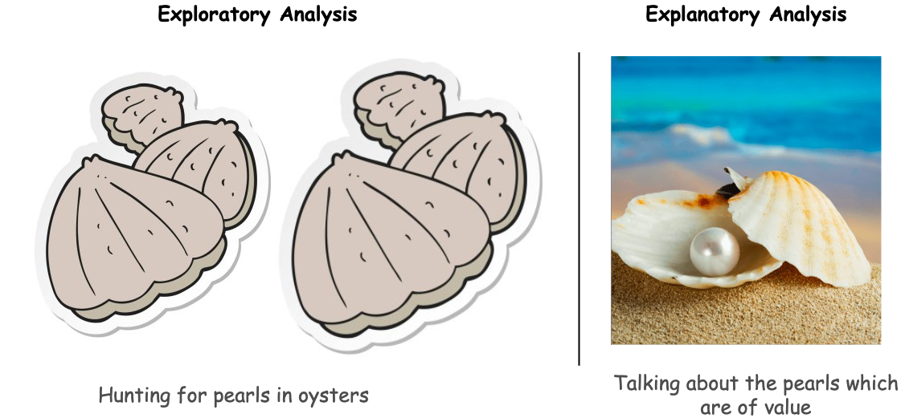
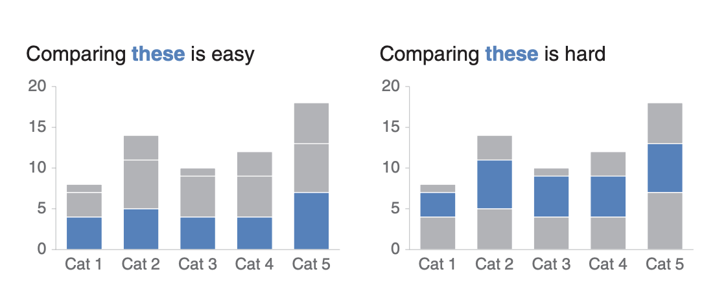
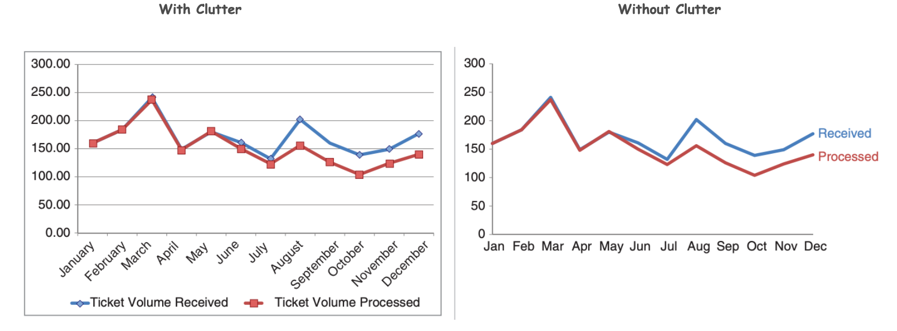

# Understanding Your Data

## Using a Critical Eye

Visualization helps bring out the story of your data and being able to tell these stories with data is of great significance for data‐driven decision making.

For example,

- How does the volume of received and processed tickets vary per month?
- Are we falling behind in terms of processing the recieved tickets? If so, from when and why?
- What are the factors slowing down the ticket processing? Are these factors correlated? [Correlation is NOT causation (Bonus)](https://www.youtube.com/watch?v=ROpbdO-gRUo)

**Exploratory vs Explanatory Analysis**

- Exploratory analysis is what you do to understand the data, finding patterns, outliers, relationships and so on.
- Explanatory analysis is communicating the key insights of the analysis to decision-makers, stakeholders, etc.

## Choose an effective visual

### **Simple Text**

Simple text is used for communicating for numbers by making the numbers as prominent as possible and a few supporting words to clearly make your point.

### **Tables**

Tables can be used for communicating to a mixed audience whose members will each look for their particular row of interest.

- Different units of measure can be elegantly displayed on tables
- Allow the data to take a center stage and lighten the borders
- Heat maps can be used to provide visual cues so that potential points of interest can be easily spotted

### **Graphs**

A well-designed graph is more effective than a table as it interacts with our visual processing system.

**1. Points**

- Scatterplots are useful for showing the relationship between two entities
- They encode data simultaneously on a horizontal x‐axis and vertical y‐axis and allow people to see what relationship exists.
- They are more frequently used in scientific fields than in the business world.

**2. Lines**

- Line graphs are most commonly used to plot continuous data, which is often in the form of some unit of time: days, months, quarters, or years
- They may not make sense for categorical data as the points in the graph are physically connected via a line

**3. Bars**

- Bar charts are allow for easy processing of visual information as our eyes compare the end points of the bars to find the largest, smallest and incremental difference
- Bar charts must always have a zero baseline
- In general the bars should be wider than the white space between the bars

- Beware of stacked bar plots as they can overwhelm your audience with information

- Horizontal bar charts are extremely useful for categorical data with long category names

### **Caveats**

- Never use 3D charts unless it is absolutely necessary to add a third dimension. 3D charts introduce skews, making the data difficult to interpret and compare
- Pie charts should be mostly avoided when representing quantitative information as it becomes almost impossible to discern segments close in size. (Use bar charts instead)
- Avoid using secondary axes as it makes the interpretation of the data tedious

## Eliminate clutter

- A human brain has a finite amount of mental processing power to process visual information (or cognitive load)
- Cognitive load is the mental effort that is required to learn new information
- Clutter in our visualization results in extraneous cognitive load and processing that takes up mental resources but doesn’t necessarily improve one's understanding of the data
- Clutter has to be avoided at all costs as it simply eats up space and make the visualization feel more complicated
- [Gestalt Principles of Visual Perception (Bonus)](https://excelcharts.com/data-visualization-excel-users/gestalt-laws/) can help distinguish between clutter and useful information

### References (Bonus)
* [Storytelling with data](https://www.storytellingwithdata.com/books)
