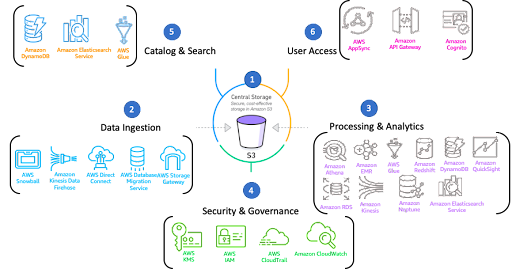
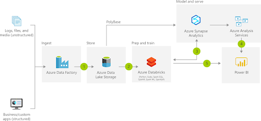
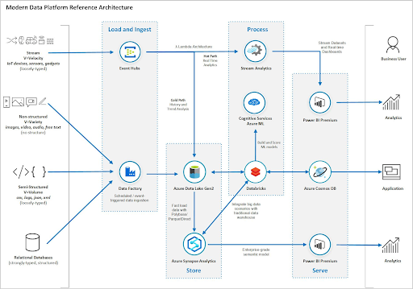
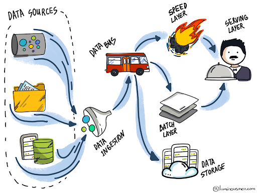

# Architecture Reference

## AWS Overview
[Reference Architecture](https://docs.aws.amazon.com/wellarchitected/latest/analytics-lens/reference-architecture.html)

## Batch Processing on Azure
[Reference](https://docs.microsoft.com/en-us/azure/architecture/solution-ideas/articles/modern-data-warehouse)

## Batch & Streaming (Lambda Architecture) on Azure
[Reference](https://docs.microsoft.com/en-us/azure/architecture/example-scenario/dataplate2e/data-platform-end-to-end)

## Lambda vs. Kappa Architecture
Read about the [differences](https://luminousmen.com/post/modern-big-data-architectures-lambda-kappa)

**Lambda**
* the two layers (speed layer & batch layer) resemble
* the two legs of the λ symbol

**Kappa**
the left stem of the 𝚱 (kappa symbol) signifies
unified input data store and processing logic 

