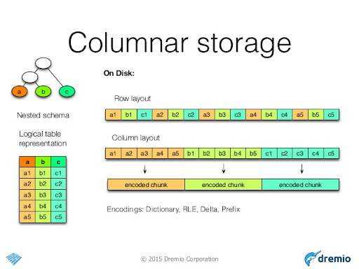
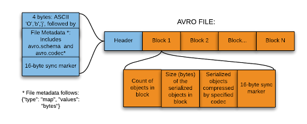

# Data Formats
## Wait...what’s data serialization again?
(extract from [Devopedia](https://devopedia.org/data-serialization))

* Data serialization is the process of converting data objects present in complex data structures into a byte stream for storage, transfer and distribution purposes on physical devices.

* Computer systems may **vary** in their hardware architecture, OS, addressing mechanisms. Internal representations of data also vary accordingly in every environment/language. Storing and exchanging data between such varying environments requires a **platform-and-language-neutral data format** that all systems understand.

* Once the serialized data is transmitted from the source machine to the destination machine, the reverse process of creating objects from the byte sequence called **deserialization** is carried out. Reconstructed objects are clones of the original object.

## Data Formats
[Big Data File Formats](https://luminousmen.com/post/big-data-file-formats)

* Video: [Avro vs Parquet](https://www.youtube.com/watch?v=jKfKmBdPuT4)
[Blog article comparing the two formats](https://www.datanami.com/2018/05/16/big-data-file-formats-demystified/#:~:text=The%20biggest%20difference%20between%20ORC,in%20a%20row%2Dbased%20format.&text=While%20column%2Doriented%20stores%20like,might%20be%20the%20better%20choice.)
* [Example with Python](https://www.confessionsofadataguy.com/big-data-file-showdown-avro-vs-parquet-with-python/)
* We’ll cover Parquet quite extensively, but here is where you’ll often find Avro:
  * [Popular choice for streaming](https://www.confluent.io/blog/avro-kafka-data/) and persisting streaming data into data lakes (e.g. [Azure Event Hubs Capture](https://docs.microsoft.com/en-us/azure/event-hubs/event-hubs-capture-overview#exploring-the-captured-files-and-working-with-avro))
* [Deeper Dive](https://www.youtube.com/watch?v=1j8SdS7s_NY&ab_channel=Databricks)

## Apache Parquet Recap

## Apache Avro Recap
The only things you need to take away are that Avro files:
* are self-describing (schema accompanies data)
* are **row-oriented**
* support schema evolution
* are a popular serialization format for **message streams**

## Check Your Learning!
Unlike MapReduce vs Spark, there’s no clear winner.
There’s always still a time and place for each of these formats!

| | CSV | JSON | Parquet | Avro |
| --- | --- | --- | --- | --- |
|Compressibility | :white_check_mark: | :white_check_mark: | | |
|Human Readability | :white_check_mark: | :white_check_mark: | | |
|Schema Evolution | | | | :white_check_mark: |
|Human Readability | | | :white_check_mark: | :white_check_mark: |