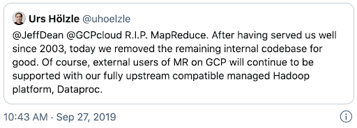

# Data Milky Way: A Brief History (Part 2) - Evolution

<figure class="video-container">
    <iframe width="560" height="315" src="https://www.youtube.com/embed/MxSwJQvWKuw" title="YouTube video player" frameborder="0" allow="accelerometer; autoplay; clipboard-write; encrypted-media; gyroscope; picture-in-picture" allowfullscreen></iframe>
</figure>

## 1980s: Databases & Data Warehouses
Since the 1980s up until the mid-late 2000s, businesses still stored both [OLTP and OLAP](https://www.youtube.com/watch?v=-v3PhEtOuxw&ab_channel=DataCamp) data in relational databases (RDBMS)
* e.g. Oracle, Microsoft SQL Server, MySQL, PostgreSQL, etc.
* OLAP-oriented databases for storing large amounts of data were called **Data Warehouses**

* Relational databases were notoriously difficult to distribute/scale out
* As more data came in, businesses often opted to scale up 💰 ([scale up vs scale out](https://hackernoon.com/database-scaling-horizontal-and-vertical-scaling-85edd2fd9944))
  * Greater investment risk, difficult to plan capacity, expensive
  * Restrictive limits to CPU & memory for a single server
  * Nowadays, modern Massively Parallel Processing (MPP) warehouses can provide scale out capabilities

However, Data Warehouses still require careful **upfront** planning
* Schema and layout need to be decided beforehand
* Query patterns/use-cases needed to be preempted
* Separation of storage and compute often a weakness (perhaps except for modern warehouses such as
Google BigQuery and Snowflake)

## Data Warehouses

Pros
* Good for Business Intelligence (BI) applications (structured data, so long as it isn't too massive)

Cons
* **Limited support** for advanced analytics & machine learning workloads
* **Limited support** for non-tabular, unstructured data (e.g. free text, images)
* Proprietary systems with only a SQL interface

Because of the limitations around flexibility and scaling, a new technology emerged in the early 2000s.

## Early 2000s: Hadoop Hype Train

Arrival of On-Prem Data Lakes
(2004) Google published the [MapReduce](https://www.youtube.com/watch?v=s8EPQpgpWVE&ab_channel=CBTNuggets) whitepaper, inspiring the Apache Hadoop project
  * enabled **(on-prem)** distributed data processing on **commodity (cheap) hardware**
  * businesses began throwing data into their Hadoop clusters!

Read: [What you need to know about Hadoop](https://www.oreilly.com/content/hadoop-what-you-need-to-know/)

## The Hadoop Disillusionment
Several years later, people became [disillusioned about Hadoop](https://www.datanami.com/2017/03/13/hadoop-failed-us-tech-experts-say/#:~:text=The%20Hadoop%20dream%20of%20unifying,find%20a%20happy%20Hadoop%20customer.):

Working with distributed computing can be extremely challenging with respect to the learning curve, especially for business analysts. Instead of working with SQL, they'd have to learn Java libraries and frameworks related to MapReduce. 

Excerpt:

:::info

Hadoop is great if you're a data scientist who knows how to code in MapReduce or Pig, Johnson says, but as you go higher up the stack, the **abstraction layers have mostly failed to deliver on the promise of enabling business analystics to get at the data.**

:::

In addition to the learning curve, the performance was surprisingly slow for BI users. They would have expected that compared to the warehouse, they woul dhave had performance gains but in fact the queries were running a lot slower on hadoop than on the traditional data warehouses.

Excerpt:

:::info

"At the Hive layer, it's kind of OK. But people think they're going to use Hadoop for data warehouse...**are pretty surprised that this hot new technology is 10x slower than what they're using before**," Johnson says.
:::

This disillusionment led to the sunsetting of Hadoop projects, including at Google (who were the inventors of the entire ecossystem).

Senior Vice President of Technical Infrastructure, Google

While data locality + coupling storage and compute in Hadoop clusters was a decent idea for data throughput… 
* Businesses were forced to increase **both** CPU & Disk when they often only needed to
scale up just one or the other
* You’d have to pay for more CPU just to store inactive, rarely-utilized data, what a waste!
* Storing and replicating data on HDFS (Hadoop Distributed File System) was **expensive**
and difficult to maintain
* Query performance was **lackluster** and other beneficial properties of RDBMS were gone

## Latency
Latency nightmare when only using disk and network (i.e. MapReduce). Let's get a feel for it relative to "humanized" time.

<figure class="video-container">
    <iframe width="560" height="315" src="https://www.youtube.com/embed/DXq5MOYGK1U" title="YouTube video player" frameborder="0" allow="accelerometer; autoplay; clipboard-write; encrypted-media; gyroscope; picture-in-picture" allowfullscreen></iframe>
</figure>

Optional: [Latency in Big Data](https://www.youtube.com/watch?v=DXq5MOYGK1U) (demonstrates the massive impact of using memory vs disk vs network in Big Data)

* Gives you a feel for the latency nightmare when only using disk and network (i.e. MapReduce)
* Hopefully demonstrates the orders of magnitude in performance gain with Spark!

## Cloud Revolution
Cloud Revolution: [Why object storage wins over Hadoop-based storage](https://www.ibm.com/cloud/blog/cutting-cord-separating-data-compute-data-lake-object-storage)
* To scale cost-effectively, we need to really separate compute and storage
  * e.g. simply provision more CPU-intensive clusters only when needed, while leaving storage the same
* As analytics and AI began to involve images, audio, unstructured data:
  * Cloud Data Lakes (often based on object storage) became the ideal storage solution

Time for **unified analytics/query engines** such as **Spark** and **Presto** to shine  💫
* [Spark](https://www.oreilly.com/library/view/learning-spark-2nd/9781492050032/ch01.html) & [Presto](https://prestodb.io/overview.html)
Both engines excel when running analytical queries against data stored on Object Storage (e.g. Amazon S3, Azure Blob Storage)
Both engines take advantage of **both memory and disk** (unlike Hadoop MapReduce which read/writes data via disk only)

**Spark** (much more on this later) is **extremely popular for programmatic (Python/Scala/Java/R) use-cases** but can also support SQL queries.

**Presto** is a popular choice for **ad-hoc interactive SQL queries** (fun fact: AWS Athena is a serverless offering based on Presto)

## Unified Analytics Engines

**Common Misconceptions**
* “Spark & Presto are NoSQL databases/data stores”
  * They’re not. But they can read/write from them 😀
* “Spark or Presto can replace all my databases”
* “Spark is an ‘In-Memory’ technology”
  * PostgreSQL/MySQL also cache data in RAM to speed up queries...but would you call them ‘In-Memory’ technologies? 😅

Many companies (especially tech giants) can even often have both Spark and Presto/Athena in their stack

### Mission Accomplished?
While being able to directly query your cloud object storage (e.g. S3, Azure Data Lake Storage) with big data engines such as Spark and Presto moved the field in a great direction, some missing pieces still remained

## 2000s - 2010s: Traditional Data Lakes

Pros
* Extremely cheap and scalable
* Open, arbitrary data formats and big ecosystem
* Supports ML

Cons
* Some BI workloads still not snappy enough
* Complex data quality problems
* No data management layer
* Difficult for GDPR compliance

## Can we get the best of both worlds?
One approach: **Data Lakehouse** (we’ll revisit this - keep it in mind!)

If you’ve ever heard about [Delta Lake](https://delta.io/), [Dremio](https://www.dremio.com/), [Databricks Photon](https://databricks.com/product/photon) stay tuned for the next lessons!
We’ll also cover how Lakehouse can serve as the technological foundation to support philosophies such as Data Mesh

* Data Mesh = Organizational & Operating Principles 
* Data Lakehouse = Storage, Compute, Data Management, Governance layers
