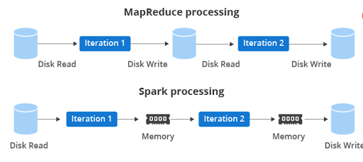

# Data Milky Way: Data Processing

<figure class="video-container">
    <iframe width="560" height="315" src="https://www.youtube.com/embed/Uc-Wtem-lyw" title="YouTube video player" frameborder="0" allow="accelerometer; autoplay; clipboard-write; encrypted-media; gyroscope; picture-in-picture" allowfullscreen></iframe>
</figure>

## Evolution of Data Processing

* [Hadoop to Spark w/ Object Storage](https://www.xplenty.com/blog/apache-spark-vs-hadoop-mapreduce/), [Data Catalogs](https://lakefs.io/metadata-management-hive-metastore-vs-aws-glue/)
* [Batch and Micro-Batch Streaming](https://www.upsolver.com/blog/batch-stream-a-cheat-sheet)
* [Continuous Processing](https://hazelcast.com/glossary/stream-processing/)

[Apache Beam: One syntax to rule them all?](https://beam.apache.org/)
* Apache Beam is based on the [Dataflow model introduced by Google](https://storage.googleapis.com/pub-tools-public-publication-data/pdf/43864.pdf)
* Aims to unify the semantics of batch & streaming processing across engines (Flink, Spark, etc.)

**You don’t necessarily need streaming, let alone Beam!** evaluate your own project’s needs. 
From our experience, most teams actually simply choose either Spark Structured Streaming or Flink (without Beam)

## Practical Data Workloads

We’re here to teach you big data skills, but in reality...

Single-Node vs. Cluster: not everything is Big Data!
[You don’t always need Spark](https://www.indellient.com/blog/a-journey-from-pandas-to-spark-data-frames/)
([sometimes Pandas deployed on a single node function/container is just fine!](https://www.indellient.com/blog/a-journey-from-pandas-to-spark-data-frames/))

Batch vs Streaming: [streaming isn’t always the solution](https://www.section.io/engineering-education/batch-processing-vs-stream-processing/)!

Batch Orchestration options
* DAG-based approaches: [Apache Airflow](https://airflow.apache.org/), [Databricks Jobs Orchestration](https://databricks.com/blog/2021/07/13/announcement-orchestrating-multiple-tasks-with-databricks-jobs-public-preview.html), [Dagster](https://dagster.io/)  
* Event-Driven + Declarative (e.g. [Databricks Auto Loader](https://databricks.com/discover/demos/delta-lake-data-integration-demo-auto-loader-and-copy-into), [Delta Live Tables](https://databricks.com/discover/demos/delta-live-tables-demo)
* Other triggers (e.g. AWS Lambda, [Glue Triggers](https://docs.aws.amazon.com/glue/latest/dg/trigger-job.html))

## Typical Data Pipeline

## Orchestration Core Concepts
But how do we make our pipeline **flow**? 🌊
* Data Engineering workflows often involve transforming and transferring data from one place to another
* Workflows in real-life have multiple steps and stages

* Sometimes, everything might work fine with just CRON jobs
* However, other times, you might want to control the state transitions of these steps:
  * e.g. if Step A doesn’t run properly, don’t run Step B because the data could be corrupt, instead run Step C
  * Once again, the concept of Directed Acyclic Graphs (DAGs) can come to our rescue

* Apache Airflow is just one nice way of setting up DAGs to orchestrate jobs 🌈
  * Note: Airflow is primarily designed as a task orchestration tool
  * You can trigger tasks on the Airflow cluster itself or on remote targets (e.g. AWS Fargate, Databricks, etc.)
  * NOT designed for transferring large amounts of actual data
  * Reference
  * Play around with Airflow locally

