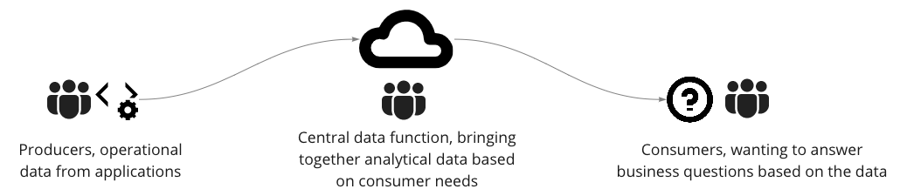

# Journey to Data Mesh (Optional)

## How we got to Data Mesh
Data Mesh is a paradigm shift in analytical data management at scale. It came in response to the emerging pattern where
there was a widening gap between data consumers and producers. The gap between data consumers and producers is often caused by 
a lack of data domain alignment, and siloed work between data sources, analytical teams, and data consumers. 

 
<figure class="video-container">
    <iframe src="https://www.youtube.com/embed/-Ajq_zzHZqE" id="ytplayer"  allowtransparency="true" frameborder="0" scrolling="no" allowfullscreen mozallowfullscreen webkitallowfullscreen oallowfullscreen msallowfullscreen width="620" height="349"></iframe>
</figure>

*[Introduction, what is Data Mesh](https://youtu.be/-Ajq_zzHZqE)*

#### What led to this gap? 
Through the evolutions of the data environment, the pattern of having a central data function to move data from 
data producers to data consumers has remained (e.g. a central data team ETL'ing prodcer data into a data lake). Even when the technologies
improved or became more advanced, the monolithic central team stayed as a constant in the analytical space. 

 

This created inevitable friction 
in the cycle of intelligence, with the producers or acquirers of the data being far removed from the consumers asking questions of the data. 
The central data function acted as a bottleneck, putting strain on a central team or set of teams that was too far removed from the production
of the data, and ended up working on the byproducts of operational systems.

#### Some of the symptoms seen as a result of these patterns:
- difficulty onboarding new data sources in a timely manner
- inability to scale to meet consumer needs / use cases
- tech-initiatives driven within siloes instead of being centred on use cases fail to be bootstrapped
- unable to realise data-driven value

 
<figure class="video-container">
    <iframe src="https://www.youtube.com/embed/j9dJ2TPowFc" id="ytplayer"  allowtransparency="true" frameborder="0" scrolling="no" allowfullscreen mozallowfullscreen webkitallowfullscreen oallowfullscreen msallowfullscreen width="620" height="349"></iframe>
</figure>

*[Additional context on the observed trends, that Data Mesh works to address](https://youtu.be/j9dJ2TPowFc)*

Read (optional): [Curse of the data lake monster](https://www.thoughtworks.com/insights/blog/curse-data-lake-monster)

