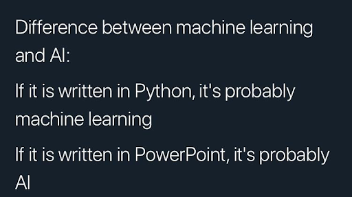
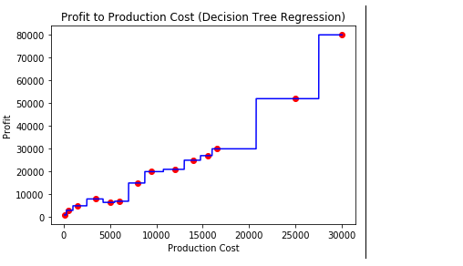
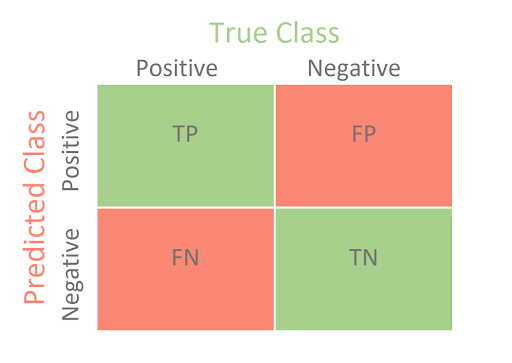
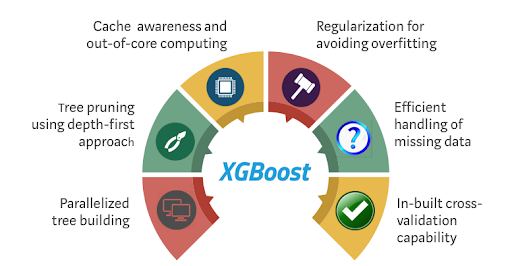
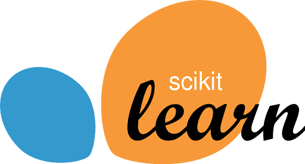
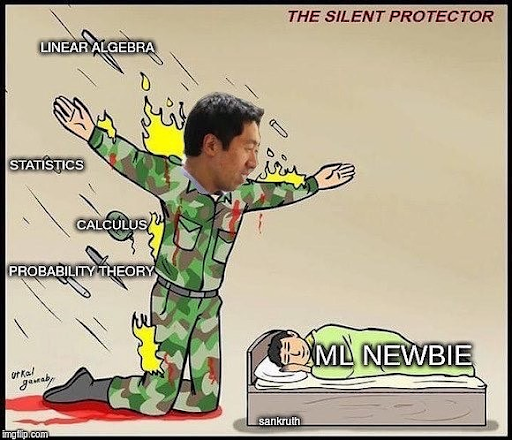
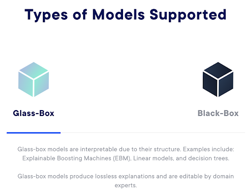

# Overview

## AI vs Machine Learning

## Misconceptions

## Machine Learning

Source: https://subscription.packtpub.com/book/big_data_and_business_intelligence/9781789537550/1/ch01lvl1sec10/differences-between-classification-and-regression

Feeling Lost? [Machine Learning Estimators Map](https://scikit-learn.org/stable/tutorial/machine_learning_map/index.html)

### Supervised Learning
* Classification
  * Binary:
    * should this loan be approved?
    * Is this a picture of a cat or a dog?
  * Multi-class: what bird species is this picture?
* Regression
  * Many-to-one:
    * Predicting the price of a second-hand car
  * Many-to-many:
    * Forecasting sales for the next 3 months

### Unsupervised Learning
* Clustering, Topic Modelling
* Dimensionality Reduction

### Optimization & Reinforcement Learning
* Convex Optimization, Genetic Algorithms 
* Deep Reinforcement Learning

## Intuition
 

What are some limitations of linear models (y = mx + b)? or even multiple linear regression (y = m1x1 + m2x2 + … + b)?
* Assumes **monotonic gradient (slope)** between the target variable (y) and any feature (e.g. x1)
* Assumes **constant slope steepness** between the target variable (y) and any feature (e.g. x1)
  for the entire domain of that feature

Machine Learning models can often provide the **flexibility** to overcome this. Think of it as **automatic curve fitting** and **if-else**!
  * You don’t need to hard-code the predicates
  * The algorithm will determine and optimize your if-conditions

However, note the issue happening with the green line in the picture 😵

## Data Science
### Trade-offs in modelling

* Flexibility vs Generalization
* Overfitting vs Underfitting 
  * How can we avoid overfitting in particular?
* Complexity vs Interpretability
  * Is that dichotomy still strictly true today?

### Modelling in the real world

* ML & Deep Learning training
  * can be expensive and difficult to debug, start simple!
* Explainability
* Are point estimates always enough?
* some stakeholders require [uncertainties / confidence intervals](https://machinelearningmastery.com/uncertainty-in-machine-learning/)

### What problem are you actually trying to solve?

* Machine Learning models optimize for a single objective function
  * [Pick the appropriate objective!](https://developers.google.com/machine-learning/crash-course/classification/precision-and-recall)
    * Are False Positives or False Negatives most detrimental to business and/or society?
    * If so, balance it with ‘overall accuracy’
* Communicate with business & stakeholders
* Evaluate holistically, not just with one metric
  * Classification examples
    * [Confusion matrix](https://developers.google.com/machine-learning/crash-course/classification/true-false-positive-negative)
    * [ROC and AUC](https://developers.google.com/machine-learning/crash-course/classification/roc-and-auc), ([detailed, clearly explained video](https://www.youtube.com/watch?v=4jRBRDbJemM&ab_channel=StatQuestwithJoshStarmer))
  * Regression examples
    * [Error distributions](https://scikit-learn.org/stable/modules/model_evaluation.html#regression-metrics)

## Tools

* Forecasting
  * [Prophet](https://facebook.github.io/prophet/)
* Machine Learning
  * scikit-learn
    * plenty of models and preprocessing methods to choose from (except for large-scale deep learning)
  * XGBoost (RandomForests on steroids)
    * Popular choice for winning Kaggle competitions!
  * InterpretML (see next slides)
* Deep Learning
  * PyTorch
    * Super flexible, create any model architecture
  * TensorFlow 
    * the Keras API is super easy to use 
    * if not using Keras, probably better to go with PyTorch
* MLOps, CD4ML 
  * [MLflow](https://mlflow.org/) for experiment tracking, logging, model versioning
  * [DVC](https://dvc.org/) for data versioning
  * [Azure Machine Learning](https://azure.microsoft.com/en-us/services/machine-learning/) and/or [AWS SageMaker](https://aws.amazon.com/sagemaker/) 
    * covers full lifecycle management

## Online Courses

[Deep Learning Specialization - Andrew Ng](https://www.coursera.org/specializations/deep-learning)
Everybody loves it.

[fast.ai](https://www.fast.ai/)
Slightly more challenging + free

## Interpretability

Why is interpretability crucial?
* Safety & accountability
* Fairness & bias
* Regulatory compliance
* Security
  * Adversarial attacks
  * Must-watch: [How many pixels does it take to fool a model?](https://www.youtube.com/watch?v=SA4YEAWVpbk&ab_channel=TwoMinutePapers)

Christoph Molnar: [Interpretable Machine Learning](https://christophm.github.io/interpretable-ml-book/)
* Great introduction to concepts and theory
Fundamentals: [LIME](https://christophm.github.io/interpretable-ml-book/lime.html) & [SHAP](https://shap.readthedocs.io/en/latest/index.html)

### Modern Toolkits
* [InterpretML](https://interpret.ml/)
  * [Intro Video](https://www.youtube.com/watch?v=MREiHgHgl0k&ab_channel=MicrosoftDeveloper), [Deep Dive](https://www.youtube.com/watch?v=WwBeKMQ0-I8&ab_channel=MicrosoftDeveloper)
  * Includes various explainability techniques
  * You can even build advanced yet interpretable models from the ground up
* [Fairlearn](https://fairlearn.org/)
  * Assess and (automatically) mitigate unfairness in your current models

## CD4ML - Business Applications
Emily Gorcenski: [Why bother with Continuous Delivery for Machine Learning](https://www.youtube.com/watch?v=UzVa5azAHkc)