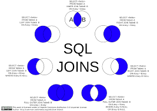
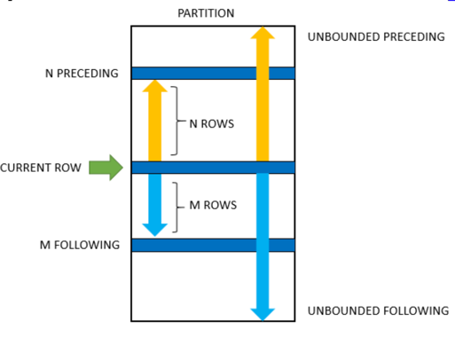
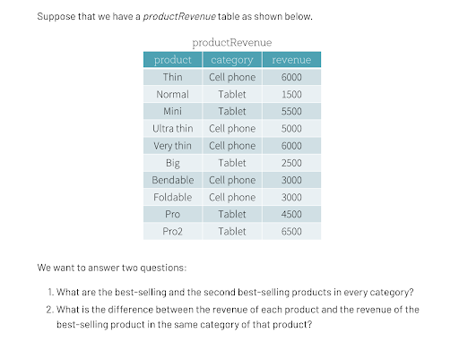

# SQL: A Quick Review

* [Joins](https://www.w3schools.com/sql/sql_join.asp) and [Unions](https://www.w3schools.com/sql/sql_union.asp)
* [Aggregate Functions (GROUP BY)](https://www.w3schools.com/sql/sql_groupby.asp)
* [Window Functions](https://mode.com/sql-tutorial/sql-window-functions/)
* What’s so great about them anyways? (See next slide)
* [Indexes & Query Plans](https://www.khanacademy.org/computing/computer-programming/sql/relational-queries-in-sql/a/more-efficient-sql-with-query-planning-and-optimization)
Must-know general knowledge, but we will not test this

## Window Functions

* What limitations have you faced in your analytics when using GROUP BY in the past?
* How can you do rankings per each category efficiently?
* How can you get the entire row of the best-selling product? (imagine you want to see additional attributes of this product)
