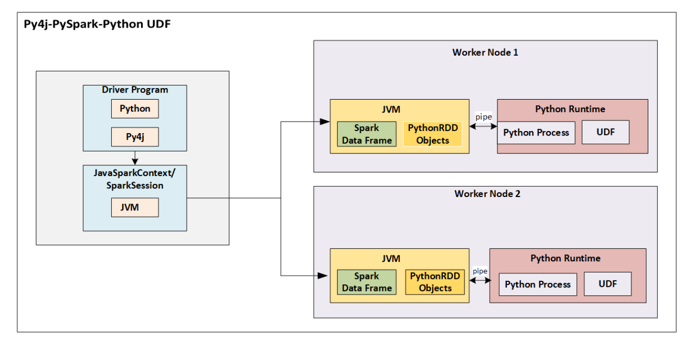
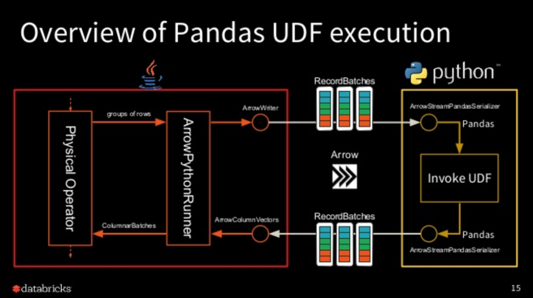
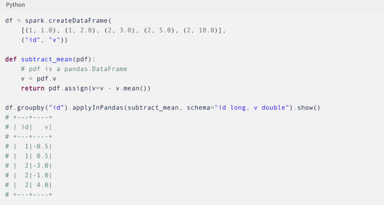

# Wrangling with Spark

<figure class="video-container">
    <iframe width="560" height="315" src="https://www.youtube.com/embed/r418tWNnAq8" title="YouTube video player" frameborder="0" allow="accelerometer; autoplay; clipboard-write; encrypted-media; gyroscope; picture-in-picture" allowfullscreen></iframe>
</figure>

## Working with Databricks
We'll walk through some of the basic transformation methods using notebooks

1. [Create a Commmunity Edition Account](https://community.cloud.databricks.com/login.html)
2. [Download Exercises](https://github.com/data-derp/small-exercises/raw/master/databricks-spark-training.dbc)
3. Upload the .dbc file to Databricks
    

## What's Missing from These Notebooks?

Short Answer:
* The really cool stuff
* Window Functions
* Pandas UDFs (Vectorised UDFs)

## Window Functions
Just make sure you understand everything about window function semantics

* partitionBy
  * similar to groupBy (but doesn’t reduce/aggregate information down to a single row)
* orderBy
  * Just FYI, you can orderBy(F.col(“myColumn”).desc()) for descending order.
* rowsBetween
  * You should look up the default arguments for different window functions (e.g. lag, lead, first, last, max, min, row_number)
* rangeBetween
  Can you explain the difference between rowsBetween and rangeBetween?

These are all also concepts in SQL.

## Python UDFs

### How can I bring in my own custom Python logic?
(needs other libraries, not available as pyspark built-in functions)

**Basic Answer:** [Python UDFs](https://docs.databricks.com/spark/latest/spark-sql/udf-python-pandas.html)

How does this work? 
  * JVM serializes data and sends it to the Python process 
  * Python process deserializes, then serializes it back to the JVM 
  * JVM deserializes the data for running next operations/steps

### But..how can we be more efficient when switching between the JVM and Python??
**Basic Answer:** Vectorization

How does this work? (the Apache Arrow project is basically dedicated to this!)
* Batches/chunks of a single/multiple column(s) are serialized compactly/efficiently then sent to the Python process
* Which Python library is really good at vectorized operations on data again?
  * Pandas! uses NumPy (written in C) under the hood
* Chunks of data are serialized then finally sent back to the JVM

> A pandas user-defined function (UDF)—also known as vectorized UDF—is a user-defined function that uses Apache Arrow to transfer data and pandas to work with the data. pandas UDFs allow vectorized operations that can increase performance up to 100x compared to row-at-a-time Python UDFs. ([Reference](https://docs.databricks.com/spark/latest/spark-sql/udf-python-pandas.html#pandas-user-defined-functions))

This even allows you to run custom logic per each group of data in a distributed manner:

Pandas DataFrame **IN**
Pandas DataFrame **OUT**
This is **massive**.

[Reference Docs](https://docs.databricks.com/spark/latest/spark-sql/pandas-function-apis.html)

### Wowww, how do I actually use Pandas UDFs then?
**Basic Answer:** Learn the different types of [Pandas UDFs](https://docs.databricks.com/spark/latest/spark-sql/udf-python-pandas.html) AND [Pandas Functions APIs](https://docs.databricks.com/spark/latest/spark-sql/pandas-function-apis.html)

* Example blog post ([potentially outdated](https://databricks.com/blog/2017/10/30/introducing-vectorized-udfs-for-pyspark.html))
* Series to Series (these can often directly replace your Python UDFs)
* Grouped Map (Pandas Functions APIs)
  * This is **THE holy grail**, you can parallelize data processing by treating each “group” as an independent Pandas DataFrame

## A Deeper Reference
Check out O'Reilly's ["Learning Spark" book](https://www.oreilly.com/library/view/learning-spark/9781449359034/)