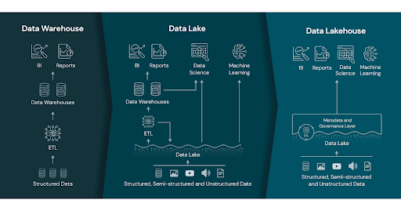

# Lakehouse Architecture
We've talked about Data Warehouses and how they evolved to Data Lakes. The Lakehouse Architecture is one way in which we can leverage the benefits of both worlds.

<figure class="video-container">
    <iframe width="560" height="315" src="https://www.youtube.com/embed/CfubH7XpRVw" title="YouTube video player" frameborder="0" allow="accelerometer; autoplay; clipboard-write; encrypted-media; gyroscope; picture-in-picture" allowfullscreen></iframe>
</figure>

## What does a Lakehouse Architecture look like?

<figure class="video-container">
    <iframe width="560" height="315" src="https://www.youtube.com/embed/rqn-BnEx9fE?start=417" title="YouTube video player" frameborder="0" allow="accelerometer; autoplay; clipboard-write; encrypted-media; gyroscope; picture-in-picture" allowfullscreen></iframe>
</figure>

## References (Bonus)
* [Original published article about Lakehouse Architecture](https://www.cidrdb.org/cidr2021/papers/cidr2021_paper17.pdf) - 
* [Databricks Lakehouse Architecture (complete with Photon, Workflows, and Governance)](https://www.youtube.com/watch?v=5oz5dwHU_mM)
