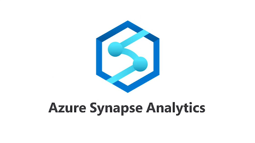
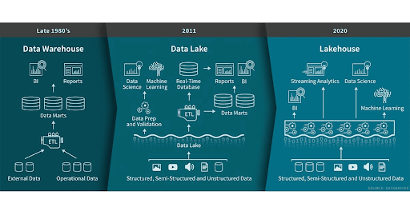

# Paradigm Shifts
## History of Big Data - Revisited
* Databases
  * single node servers, vertical scaling only
  * mostly used for operational data, transactions
* On-Prem Data Warehouses
  * horizontal scaling possible
  * utilized massively parallel processing (MPP) to run big queries
  * SQL-only interface, low interoperability
* On-Prem Data Lakes
  * Hadoop ecosystem
  * Data Processing via MapReduce, Hive, Spark, etc.
  * Difficult for data governance and data integrity 

## Cloud Big Data Paradigms

### Cloud Data Warehouses

Pros:
* Decoupled storage and compute
* Excellent for BI, Reporting, Dashboarding

Cons
* Your data gets locked away in a proprietary data format
* SQL only, limited programmatic support (sometimes needed for ML/AI use-cases)
* Limited support for unstructured data (e.g. text, images, audio, video)

### (Vanilla) Cloud Data Lakes

Pros
* Decoupled storage, compute, and data
* Open, interoperable data formats (e.g. Parquet)
* Supports unstructured data
* Enables highly scalable ML/AI use-cases

Cons
* Can be susceptible to poor data quality/integrity
* Not as fast as a database/data warehouse for interactive needs (e.g. dashboards with several drilldowns/complex queries)

### Can we get the best of both worlds?
Data Lakehouse

Source: [Databricks](https://databricks.com/blog/2020/01/30/what-is-a-data-lakehouse.html)

## Example Lakehouse Contenders

**The Cloud Providers**
[AWS](https://aws.amazon.com/big-data/datalakes-and-analytics/data-lake-house/): Glue Ecosystem, Athena, Lake Formation, etc.
[Azure](https://techcommunity.microsoft.com/t5/analytics-on-azure/simplify-your-lakehouse-architecture-with-azure-databricks-delta/ba-p/2027272): Azure Databricks, Azure Synapse Ecosystem, etc.

**Databricks**
[Photon engine](https://docs.databricks.com/runtime/photon.html): shifting Spark from the JVM to C++
[Databricks SQL](https://databricks.com/product/databricks-sql):
* Takes advantage of Delta Lake for data integrity
* Photon for fast, interactive queries

**Dremio**
* Utilizes Apache Arrow (the very same underlying technology in Vectorized UDFs (aka Pandas UDFs)! for scalable data transfer and serialization
* Informally, think of it as next-gen Presto/Athena

## Takeaways
Big Data Technology is rapidly maturing to support the needs of Data Mesh