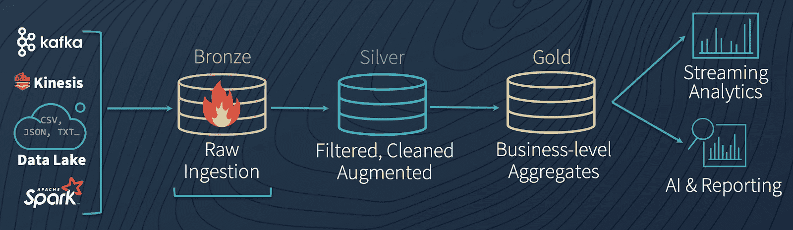

# Overview
Now that we've covered the theory behind Data Engineering, we'll spend the next few sections putting that to practice in the context of a domain. We'll do that by asking a relevant domain question and then walking through the data processing steps and architectures required to answer that question.

## The Question Matters
 It is pertinent to note that it is impportant to truly understand the problem we are solving and the requirements around the freshness of data, because different problems/requirements can result in vastly different data processing architectures.

For example, a supplier might process historic trends of a particular product to predict how much supply that they might need to meet a regular demand. In this case, a simple batch job once per night (or even better, on the first of every month) is sufficient. In a situation where demand is unpredictable or spikes unexpectedly, the supplier might require closer to real-time data (in which we would consider streaming solutions), in order to calculate new pricing (for example Uber's surge pricing) on the fly.

Regardless of whether we answer our question using batch or streaming architectures, we often come across a few common landmarks of Data Processing.

## Common Landmarks of Data Processing
### Data Source
This is the source of data. For many of our Data Engineering use cases, it is often data that is generated as a result of a transactional application (e.g. e-commerce application) and stored in a database that fits the transactional application's usecase. This could be a Postgres or mysql database, but it could also be json/csv files, as a result of previous processing.

### Ingestion
This step is the action of reading from the data source. We often read or ingest data as-is or close to as-is so that it allows us to debug or reprocess data in case of pipeline/processing failures. 

### Transformation
Once the data has been ingested, transformation logic aggregates and shapes the data into a form that can be easily underestood and analysed, or used downstream in another pipeline. We sometimes see this in the form of Bronze, Silver, Gold stages which represent increasingly curated levels of data. It's not required to use the Bronze, Silver, and Gold model all the time; sometimes it is enough to think through your problem and determine relevant and pragmatic stages from there.

[Source: Databricks](https://www.databricks.com/blog/2019/08/14/productionizing-machine-learning-with-delta-lake.html)

### Visualisation
Typically, we spend quite some energy in the Ingestion/Transaformation space to get the data into a specific shape but we mustn't forget about why we ingested/transformed data in the first place: to give transparency and insights into a system in order to make an informed decision or opinion. Visualisations is just one form of how we use data to bring value to a consumer and can come in the form of a graph/charts or list of data. Different forms of visualisations are deemed appropriate in efficiently communicating different kinds of messages.

### Intelligence
Another consumer of curated data are Intelligence applications. This could be a Machine Learning model which uses analytical/curated data as training data which could drive a recommendation engine in e-commerce or streaming media systems. Often, Machine Learning models require lots of [relevant] data for training and a different set of data for testing the model and work with Data Engineers to obtain the right kind of data. Sometimes a Data Scientist or Machine Learning Engineer will simply request "all the raw data" if the data is too well curated or aggregated but in reality, this is really just the start of a conversation and strong collaboration between a ML Engineer and a Data Engineer to leverage the best of the toolsets between the two expertises (e.g. distributed data processing engines, MLOps tooling). In this training, we won't build our own ML model, but will describe the ML process in a later section since Data Engineers might be in the position to supply data to ML Engineers.

