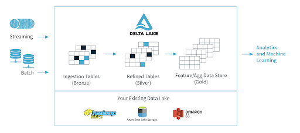
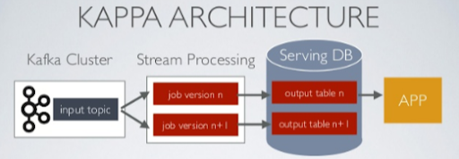

# Data Milky Way: A Brief History (Part 4) - Architecture Reference

<figure class="video-container">
    <iframe width="560" height="315" src="https://www.youtube.com/embed/Mzz4o2xDVzw" title="YouTube video player" frameborder="0" allow="accelerometer; autoplay; clipboard-write; encrypted-media; gyroscope; picture-in-picture" allowfullscreen></iframe>
</figure>

## Typical Data Pipeline

## Open Source Example Architecture

[Reference](https://towardsdatascience.com/scalable-efficient-big-data-analytics-machine-learning-pipeline-architecture-on-cloud-4d59efc092b5)

## AWS Overview

[Reference Architecture](https://aws.amazon.com/blogs/architecture/field-notes-how-to-build-an-aws-glue-workflow-using-the-aws-cloud-development-kit/)

This example uses AWS Glue. There are other AWS services like EMR that can handle even more complex cases.

## Batch Processing on Azure

[Reference](https://docs.microsoft.com/en-us/azure/architecture/solution-ideas/articles/ingest-etl-stream-with-adb)

## Batch & Streaming (Lambda Architecture) on Azure

[Reference](https://docs.microsoft.com/en-us/azure/architecture/example-scenario/dataplate2e/data-platform-end-to-end)

## Lambda vs. Kappa Architecture
Read about the [differences](https://luminousmen.com/post/modern-big-data-architectures-lambda-kappa)

**Lambda**
* the two layers (speed layer & batch layer) resemble
* the two legs of the λ symbol

**Kappa**
the left stem of the 𝚱 (kappa symbol) signifies
unified input data store and processing logic

