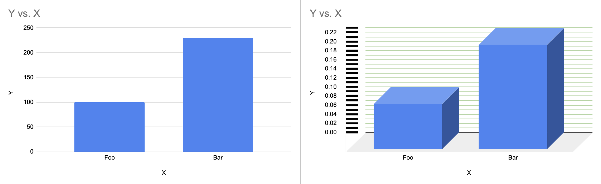
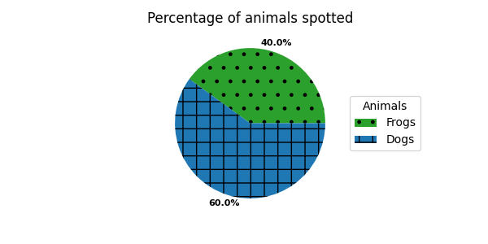

# Graphical visualization

As stated above graphs can be one form to visualize data. Especially for those there are some criteria which can be 
considered regarding the design or the technical integration of the graphs on a web-based interface.

## Design choices

### Keeping it simple

“Data graphics should draw the viewer’s attention to the sense and substance of the data, not to something else. […]” 
- Edward Tufte; [The Visual Display of Quantitative Information](https://www.edwardtufte.com/tufte/books_vdqi)

- Reduce clutter.
- Avoid animations (and if they are necessary, provide a way to turn them off).
- If possible: offer a light and a dark version (e.g., for people who are sensitive to bright colors).
- Using scalable image formats such as SVG helps users to increase and decrease the size of the image without loss of detail/information.

### Colors

Due to the fact that [around 300 million people have color-deficient vision](https://www.colourblindawareness.org/), 
considering the choice of color can be crucial for the accessibility of visualizations.

### Contrast

* Use contrasts / different shades instead of multiple colors
    * A suggested level of contrast ratio for objects is 3:1
    * Tools exist that can be used for checking the contrast of two colors manually:
        * [Contrast Checker by WebAIM](https://webaim.org/resources/contrastchecker/)
        * [Contrast Ratio by Siege Media](https://www.siegemedia.com/contrast-ratio)

Some challenges might still remain:

* Using a color palette might comply with required contrast ratios but on the other hand might distract the focus in charts from the most important information for the user (e.g. when different colors are used for error-events in a stacked bar-chart)

### Conveying meaning

* If colors convey meaning, provide additional ways of differentiating
* Tools for that can include symbols, labels, patterns, texture, icon, text or overlay
* The disadvantage of additional patterns or elements in the visualization can be that it will make it even more difficult to read the information in a visualization, therefore one should avoid adding too much [chartjunk](https://en.wikipedia.org/wiki/Chartjunk).

  

> **Disclaimer**: this example image is only for illustrating the usage of patterns in addition to colors. However, it is not a good example for a chart in general. There are better ways to label charts, and the patterns and colors can be distracting instead of helping.

### Alternative texts and descriptions

* Provide short, concise alternative texts.
* There is no universally applicable alternative text for an image. The context matters.
* If applicable, provide a longer description, e.g. below the image.
* Don't start the text with "an image" or "a picture". Screen reader users already know this, because you're using the HTML image element.

### More resources & examples

* [Harvard University: Write helpful Alt Text to describe images](https://accessibility.huit.harvard.edu/describe-content-images)
