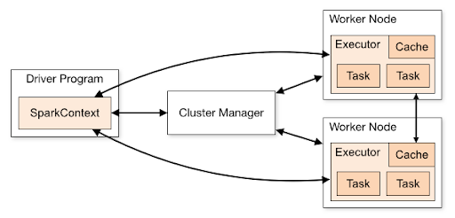

# Apache Spark
Apache Spark is a unified analytics engine for large-scale data processing. It provides high-level APIs in Java, Scala, Python, and R, and an optimised engine that supports general execution graphs. It also supports a rich set of higher-level tools including Spark SQL for SQL and structured data processing, pandas API on Spark for pandas workloads, MLlib for machine learning, GraphX for graph processing, and Structured Streaming for incremental computation and stream processing. 

[Source: Apache Spark](https://spark.apache.org/docs/2.0.1/)

## Apache Spark Topology

A typical spark cluster looks like below

<div style={{textAlign: 'center'}}>



</div>

There are several useful things to note about this architecture:
1. Three entities on a typical Spark Cluster - Driver, Cluster Manager and Workers as shown above.
2. Upon submission of Spark jobs, each Spark Application gets its own executor processes (executors are like JVM runtimes), which stay up for the duration of the whole application and run tasks in multiple threads. This has the benefit of isolating applications from each other, on both the scheduling side (each driver schedules its own tasks) and executor side (tasks from different applications run in different JVMs). However, it also means that data cannot be shared across different Spark applications without writing it to an external storage system.
3. Spark is agnostic to the underlying cluster manager. If it can acquire executor processes which communicate with each other, it is relatively easy to run Spark Applications even on a cluster manager that also supports other applications (e.g. Mesos/YARN/Kubernetes).
4. The driver program must listen for and accept incoming connections from its executors throughout its lifetime. As such, the driver program must be network addressable from the worker nodes.
5. Because the driver schedules tasks on the cluster, it should be run close to the worker nodes, preferably on the same local area network. 

[Source: Apache Spark](https://spark.apache.org/docs/latest/cluster-overview.html)

## What is a transformation? What is an action?
Spark offers two different kinds of operations:

1. **Transformations**

    Transformations are lazy operations which usually create or transform the data in one or the other way. For example:

    **a) range (1,10)** transformation creates a dataset of 10 variables ranging from 0 to 9.

    **b) filter(x > 10)** will return all variables greater than 10 from the dataset by the name x.

    Transformations themselves are of two types:

    **a) Narrow Transformations:** These transformations do not entail any network communication (e.g. range and filter transformations)

    **b) Wide Transformations:** These transformations do entail network communication (e.g. groupBy, joins, repartition). Wide Transformations usually result in redistributing data across partitions (also known as shuffling of data, explained in a later section). Redistribution is defining behaviour in wide transformations.For example, a groupBy redistributes data across partitions by the key on which grouping is needed. A join redistributes data across partitions to match joining keys.

2. **Actions**

    Actions in Spark are eager operations that trigger the execution of logic. For example, a count action triggers a job to count the number of variables created or present in a dataset. A collect collects all the data from the partitions and returns some output. Actions are usually written towards the end of your code after all the transformations are completed.

## How are transformations and actions evaluated in Spark (as a distributed system)?
Transformations and Actions are evaluated differently in Spark which lends its processing efficiency. Transformations are lazy operations which usually create or transform the data and are not evaluated until an action operation is called. Let us take a very simple example of the below code to understand this better:

```
spark.range(1,1000)
```
The above transformation creates a dataset. This dataset gets created on the worker machines as a number of input partition objects encapsulating the data. Input partitions are the in-memory JVM objects containing parts of the dataset that is being created here.  These input partition objects in turn are distributed across worker machines.
[Bonus: Learn more about input partitions here!](https://data-derp.github.io/docs/2.0/data-engineering-the-good-parts/demo-vanilla-spark#spark-input-partitions-stages-and-dags)

However, since Spark employs Lazy Loading, the partition objects do not get created in the memory of the worker machines unless an action is triggered. So let us add an action to the above code:
```
spark.range(1,1000).count()
```
When this program is submitted on the driver machine of the Spark cluster, the following steps occur:

1. The Spark Driver process with the help of Cluster Manager checks and identifies the worker on which this program will run
2. Once the workers are identified, the Driver process instructs the Worker Processes to spawn the executors.
3. Once the executors are up and running, the worker process initiates the creation of input partition objects encapsulating the data in each executor memory.
4. Since the actions is `count`, the counting of variables insides each partition happens next
5. The partition count totals are shuffled over (more on this in the later sections) to one of the identified work machines which does the overall count.
6. The overall count is sent back to the driver. The driver shows the output on the console.

[Bonus: Learn more about Spark Tasks and Operations!](https://data-derp.github.io/docs/2.0/data-engineering-the-good-parts/demo-vanilla-spark#spark-tasks-and-operations)


## What makes Spark fast and relevant to our data work?

Spark is fast and most relevant to the data work due to its following characteristics:
1. **Lazily Loaded**

    Lazy loading of Spark means that when you submit a job, Spark will only do its magic when it has to, specifically, when it receives an action (when the driver asks for some data or when it needs to write or store data; more details on this in a further section).

2. **DAG-based**

   Instead of running the transformations one by one as soon as it receives them, Spark stores   these transformations in a DAG (Directed Acyclic Graph), and as soon as it receives an action, it runs the whole DAG and delivers the requested output. This enables it to optimise its execution based on the job’s DAG, instead of running the transformations sequentially one after the other. [Source: Invivoo](https://www.invivoo.com/en/why-is-spark-fast-and-how-to-make-it-run-faster-part-ii-the-spark-magic/)

3. **In Memory Computation with an optional Caching Component**

    Spark does all its computations in memory by default. As mentioned above (in “How are transformations and actions evaluated in Spark (as a distributed system)?” section), the partitions containing  the data generated by transformations are pulled into  the memory of the worker machines at the trigger of an action. These partitions get garbage-collected as soon as the job is completed and are unavailable for subsequent jobs that require the same data. To avoid this, Spark gives the option of caching partitions. This further optimises the subsequent reruns of the same job as the partitions are in memory already due to caching. Learn more about it
    [here](https://data-derp.github.io/docs/2.0/data-engineering-the-good-parts/demo-vanilla-spark#spark-caching---introduction)

4. **Framework for Distributed Computations**

    Spark provides a framework for distributed in-memory computation. Such a facility is not  available in programming languages like Java, Python etc. One would argue that running a Java or a Python program on a distributed cluster framework like Kubernetes would effectively give the same result. Reality is, it does not due to the following reasons:
    1. Java/Python programming languages are not distributed in nature and are designed to run on single machines set up with a very small amount of data. Spark is designed to work in a distributed environment with huge amounts of data such that it distributes the data appropriately to optimise the job; this would be a manual effort in Kubernetes.
    2. A Java/Python program in Kubernetes would not provide features mentioned above (lazy loading, DAGs, In Memory computations etc). In fact, should the need arise,  Spark already has an option of running it on Kubernetes as the distributed platform. This brings in all the features of Spark to the distributed characteristics of Kubernetes

This is completely separate to running [Spark on Kubernetes](https://spark.apache.org/docs/latest/running-on-kubernetes.html), and at the time of writing, there is a common opinion that it is extremely difficult to manage and maintain, signalled by a large variety of SaaS solutions that exist for that offering. Of course, this is always up for debate. :)


## Additional Resources (Bonus)
* [Apache Spark Introduction](https://www.youtube.com/embed/Ud6luYCkkMk)
* [History of Spark](https://www.youtube.com/watch?v=p4PkA2huzVc) (first 3 minutes, skim the rest)
* [Overview of Spark (slides) by Brooke Wenig](https://brookewenig.com/SparkOverview.html#/)
* [Spark SQL Programming Guide (Python or Scala recommended)](http://spark.apache.org/docs/3.1.1/sql-getting-started.html)
* [DataFrame Methods](http://spark.apache.org/docs/3.1.1/api/python/reference/pyspark.sql.html#dataframe-apis) - e.g. df.someMethod()
* [Column Methods](http://spark.apache.org/docs/3.1.1/api/python/reference/pyspark.sql.html#column-apis) - e.g. F.col("myField").someMethod()
* [The different Data Types in Spark!](http://spark.apache.org/docs/3.1.1/api/python/reference/pyspark.sql.html#data-types)
* [The Sacred Texts](http://spark.apache.org/docs/3.1.1/api/python/reference/pyspark.sql.html#functions) - pyspark.sql.functions
* [Windows](http://spark.apache.org/docs/3.1.1/api/python/reference/pyspark.sql.html#window) - you’re going to want to read this carefully 😉
* [Campus PySpark & AWS + Spark Architectures](https://www.udemy.com/course/pyspark-aws-master-big-data-with-pyspark-and-aws/) (optional, when you have time)

