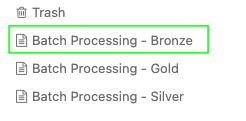
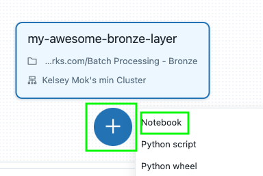
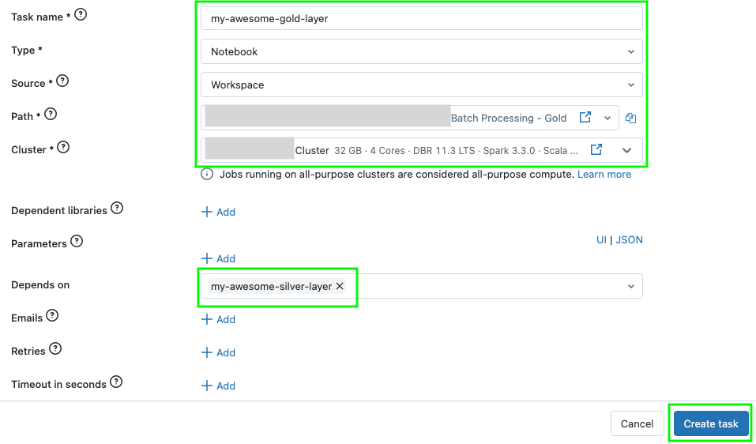
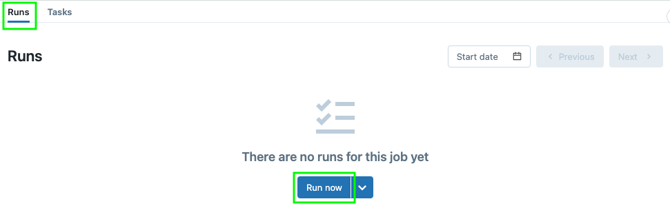

# Exercise: Create a Workflow
Quite often, when transforming data, there are several stages of transformation, which when run one after another form what we call a "Data Pipeline" or a "Workflow". For example, a Workflow can start with an ingestion job, then feature several transformations that can fan-out and then fan-in. These Workflows can become rather complex in nature, and it leaves room for human error when individual steps are triggered manually or variability in a large team. In order to encourage reproducibility, it is encouraged to use a Workflow or Data Pipelining tool, in which individual jobs and its properties (like dependencies from which to trigger) are defined. These dependencies are often represented by a [DAG (Directed acyclic graph)](https://en.wikipedia.org/wiki/Directed_acyclic_graph). There are a variety of Workflow/Data Pipelining tools that exist such as [Dagster](https://dagster.io/), [Airflow](https://airflow.apache.org/), and other Platform- or Cloud-native offerings.

Coming back to our existing Batch use case, workflows for Batch Transformations are often started with a manual trigger or automatically in response to an event or cron schedule. In this exercise, we will create a Workflow in Databricks to trigger first our Bronze transformation, and upon success, trigger the Silver transformation logic.

1. In the left-navigation window in Databricks, open **Workflows** 

    

2. Next, click **Create Job**

    

3. Enter a name for the task that will run your Bronze logic and choose the type **Notebook**.

    

    Note that there are a variety of logic types to choose from aside from **Notebook**. In more production settings, we might opt to package our logic in a jar or Python Wheel. In this case, we're using the logic created in Notebooks in earlier exercises.

    

4. Next, for the **Path** field, choose the **Batch Processing - Bronze** Notebook from your Workspace:
    
    

5. For the **Cluster** field, choose your Cluster. Click **Save**.

    

6. Click the big **+** button to create your next task (for the Silver logic) and select Notebook

    

7. Repeat the same steps as earlier but name this task uniquely (to represent the Silver logic). Note that there is now a dependency on the Bronze task. Click **Create Task**

    

8. Click the big **+** button to create your next task (for the Gold logic) and select Notebook

   

9. Repeat the same steps as earlier but name this task uniquely (to represent the Gold logic). Note that there is now a dependency on the Silver task. Click **Create Task**

   

10. Click the **Runs** tab at the top left and click "Run now" to trigger your job. If your cluster is not already running, it probably will take a while.

    

11. Success!

    

## Reflect
### What are some drawbacks of our notebooks that might affect pipeline processing time?
Our notebooks deliberately and by design contain tests to enhance the learning experience. In a production setting, the functions that have been written might be pulled out to a single file and packaged into a jar or Python wheel without the tests.

### How can I avoid using the UI to create these Workflow tasks?
Databricks jobs can be [written in declarative form through tools like Terraform](https://www.databricks.com/blog/2022/12/5/databricks-workflows-through-terraform.html).