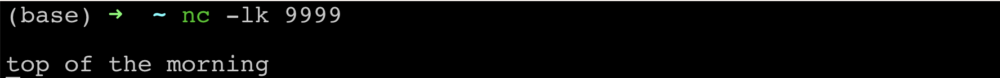
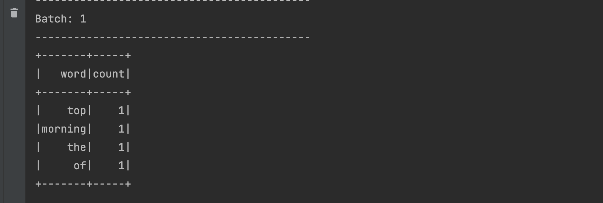

# Checkpointing

We now understand that stream processing applications in Spark run in an infinite loop of micro-batches. These applications run on a continuous basis on an unbounded set of real time data. We also know that any application in general cannot run for an infinite amount of time even if we want them to do that, for two practical reasons:

1. Applications often suffer system failures or cluster crashes.
2. Systems sometimes need to be brought down for periodic maintenance.

This means that our applications need to be able to handle stoppages and when they do happen due to the aforementioned reasons, we would want them to recover gracefully. This is where checkpointing comes into picture.

Spark Checkpointing provides the ability to 'bookmark' a data stream when a streaming application stops and uses the bookmark to pick up where the application left off when the application is restarted. It accomplishes that by maintaining a checkpoint location either locally or remotely (more on local/remote bit in the later sections). Spark checkpoints comprise two key items :

1. **Read position** - the start and end date range of the current micro-batch.
2. **State information** - the state that applications would want to maintain across micro-batches, when working with Stateful Streams

## Checkpointing Requirements

Checkpoints in Spark can be leveraged to their full benefit if we fulfill the following requirements:

1. Reliably update the checkpoint location when new data has been processed (starting an application from an old location will result in duplicate data processing)
2. Use a source (e.g. File Source, Kafka Source) from which data can be replayed (this is useful for incomplete data in a certain micro-batch).
3. Processing logic is consistent and idempotent (the same result is obtained when given the same input data)

Let us now look at an example of how checkpoints are actually created. We will use the same Stateful Streaming
Wordcount code from [previous sections](https://data-derp.github.io/docs/2.0/beyond-the-batch/stateful-vs-stateless-streaming/) and add checkpointing code to it.

1. In the writestream code of Stateful Streaming Wordcount example, add one more option to enable checkpoints when the program runs as shown below (make sure that you are giving a location somewhere in the user directory of your local machine as the other locations might not give the privilege to your program to create a directory and write data to it)
   
2. Start a fresh terminal with netcat and start your program from pycharm as done in the previous sections. You should see the all familiar empty batch in the pycharm output. More importantly, you should be able to see the checkpoint folder created in the location given in your code above.
3. Send some data from your netcat terminal as before
   
4. Like before, you should see this in your program’s output
   
5. Stop and restart netcat and the PyCharm program. Your program should be able to read the previous data from the checkpoint and show the output in PyCharm.
6. Now try sending similar data with repeated words from the terminal
   
7. You should see the usual stateful aggregation happening in the output as we saw in the previous section.

Congratulations! You’ve implemented a Spark streaming application that uses checkpoints! Your application is now resilient to restarts and can restart where it has left off.
