# Handling Late Data

We have seen that Spark Structured applications can store and aggregate data across micro-batches (Stateful streaming)[hyperlink]. Spark runtime stores this data in what Spark calls a `statestore`. This statestore uses the executor memory of the worker machines. Now a couple of questions have probably crossed your mind:

1. Does Spark statestore store the data forever? Yes, at least until the application crashes or it is brought down for routine housekeeping. Spark Streaming applications are designed to handle these kinds of interruptions in this fashion.
2. Should we keep the data in the statestore of the Spark Streaming Application forever? Well, not really, for 2 reasons below:
   1. As mentioned above, the statestore uses the executor memory which is finite and will sooner or later get exhausted. This usually results in either the Spark job being stuck for a very long time or ultimately crashing.
   2. The use case might not require you to store the data forever. For example, you may have an application where you would want to see the running totals of the invoices of the last 1 hour. Every hour, you would want to move the data to an external storage and clean the statestore.

Above are just a few examples where you might not want to maintain the data in your application forever. This is where the concept of windows and late data comes into picture.

## Time Windows

Windows are an important temporal concept for managing data and its state in Spark Streaming applications. They are the time intervals on which we can segregate and aggregate the incoming streaming data from the source. The time for which such windows are created is usually the Event Time i.e the timestamp for which the data was generated at the source. Please note that the aforementioned Event Time is different from the Trigger time, which is the start time of the micro-batch by the Spark runtime. Also note that Time Windows are used only for Stateful Spark Streaming applications because, afterall, we are trying to efficiently manage the state so that our applications do not store the data forever.

There are two types of Time Windows in Spark Streaming:

- Tumbling Time windows
- Sliding Time windows

### Tumbling Time windows

Tumbling Windows are fixed, non-overlapping and contiguous (or back-to-back) time windows that we can create based on the Event time. For Eg. A 15 minute tumbling window can be created for data generated between 12:00 PM to 12:15 PM, 12:15 PM to 12:30 PM and so on. Let us understand the concept of tumbling window in more detail with the help of an example below:

Let’s say we are developing an application which is processing the data generated from a stock market application. The stock market application is sending data in the following on periodic basis to our application:


| Field | Type |
| :-------: | :----: |
|  EventTime   | String |
|  Symbol   | String |
|  Price   | String |

Our application should receive the above data and create a **1 minute tumbling time window**. Also, to demonstrate the windowing aggregates, our application should sum up all the prices for the stock symbol generated within each time window of 1 minute.

To implement the above example, we will use the netcat application (Socket Source) from our previous examples [hyperlink] to simulate data streaming from the stock market application. Note: the full application code below can be found here[hyperlink to .py file]; please follow the README[hyperlink] to ensure that all dependencies are satisfied before running it. We will start by writing the Spark Streaming code for the above application requirement to receive the “Event Time, Symbol, Price” from the source:

1. Start with reading the data from the source

   ```python
    spark = SparkSession \
        .builder \
        .appName("Tumbling Window Wordcount") \
        .getOrCreate()

    spark.sparkContext.setLogLevel("ERROR")

    socketStreamDF = spark.readStream \
        .format("socket") \
        .option("host", "localhost") \
        .option("port", 9999) \
        .load()
   ```

2. Split the data and create columns like `EventTime`, `Symbol` and `Price` and store the reference in `stocksDF` dataframe
   ```python
   stocksDF = socketStreamDF.withColumn("value", split("value", ","))\
       .withColumn("EventTime", to_timestamp(col("value")[0], "yyyy-MM-dd HH:mm:ss")) \
       .withColumn("symbol", col("value")[1]).withColumn("price", col("value")[2].cast(DoubleType()))
   ```
3. Create a Time Window of 1 minute. Note that Time Windows are created by using the `groupBy` transformation followed by some kind of aggregation. This essentially means that we are creating aggregating windows of 1 minute each which will later on help to decide which events to keep or discard.
   ```python
   # Group the data by window and word and compute the count of each group
   windowedWords = stocksDF\
       .groupBy(window("EventTime", "1 minute"), stocksDF.symbol)\
       .agg(sum("price").alias("totalPrice"))
   ```
4. Lastly, write the data to the output console sink:
   ```python
   # This is like writing the data to the sink, console in this case
   query = windowedWords \
       .writeStream \
       .outputMode("complete") \
       .format("console") \
       .option('truncate', 'false') \
       .start()
   ```
5. You can get the complete code of this example here [hyperlink]

Run the application

1. Open a fresh terminal window and open netcat at port `9999` as shown below:
   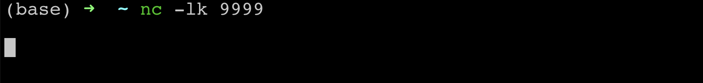
2. Run the above program from Pycharm. Press Ctrl+Shift+R on your keyboard to run this. Alternatively, you can also open the program in Pycharm and press the execute button as shown below.
   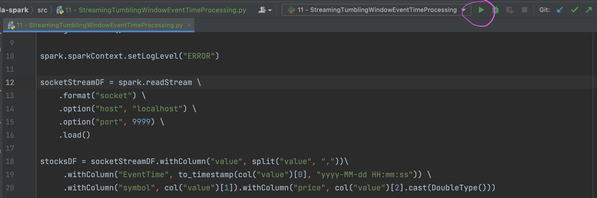
3. You should be able to see the first empty batch with `window`, `symbol` and `totalPrice` columns.
4. Let us now send `2023-04-24 12:00:05,AAPL,500` as data from netcat terminal.
5. You should be able to see this data with corresponding time window being created in Pycharm output as below:
   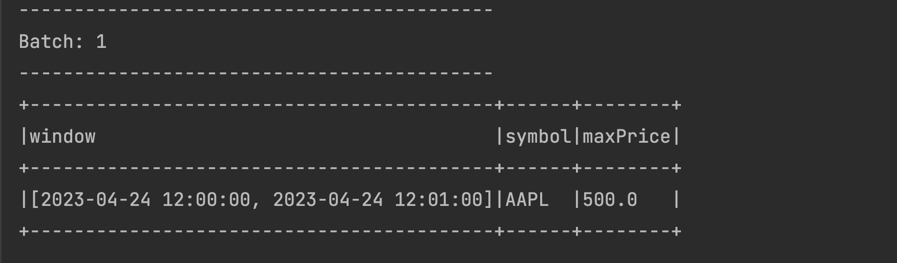
6. Try sending a similar data with changed price in the same time window with a changed timestamp: `2023-04-24 12:00:45,AAPL,600`. You should be able to see the ‘totalPrice’ column being aggregated in the same time window as below:
   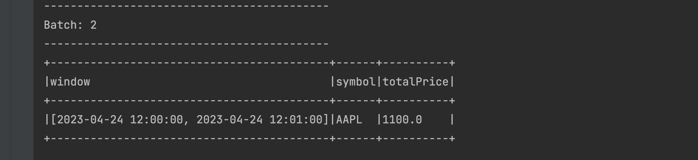
7. Send data for the next time window for the same symbol: `2023-04-24 12:01:10,AAPL,100`. You will see another record with the next window created and the latest price as below:
   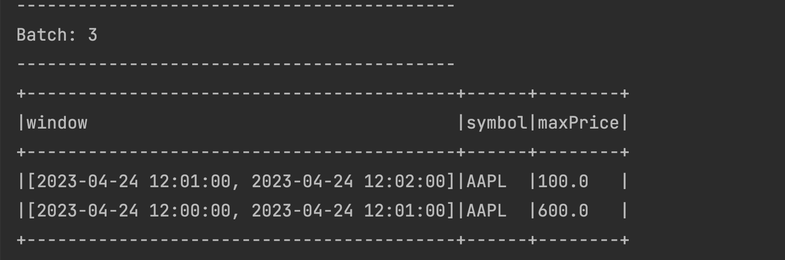
8. Try sending another set of data for the new Time Window: `2023-04-24 12:01:25,AAPL,200`. You should be able to see the new window being updated with the latest aggregate price. The previous window remains unchanged as seen below.
   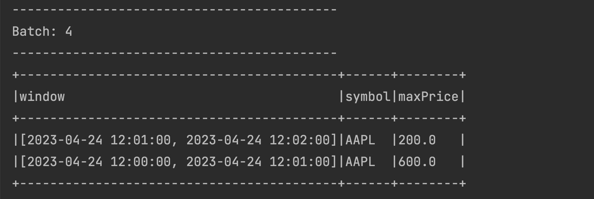

You’ve now implemented aggregations across Tumbling Time Windows!

### Handing Late Data

You might have noticed that the above program is maintaining the data in the statestore forever, even though the Spark Application managed to segregate it into Tumbling Time Windows of 1 minute each. To further validate this, try sending some data to an older window `2023-04-24 12:00:50,AAPL,100` assuming that it has arrived a bit late to your application. You will see the older window being updated with the latest aggregate of 1200 as below:
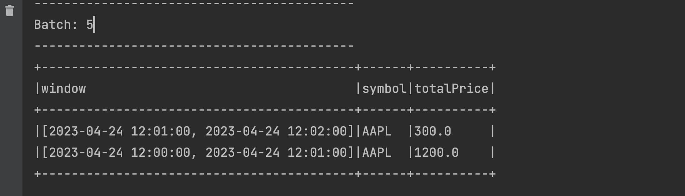
What happened ? The application retains all the data because we have defined the output mode as `Complete`. As we have understood in the `Output modes` section [hyperlink], `Complete` output mode is designed to retain the data in the `statestore` forever. If we want our Spark Application to clean up the data for older windows and also stop accepting any late data in those windows (often a business decision/requirement), we will have to add what Spark calls as `Watermark` to the application code.

### Data Clean Up with Watermarks

Watermarks are the expiry threshold that we set up in our programs after which the older windows and their data expire. This expiry threshold for watermarks is usually driven by business requirements. Since the older windows cease to exist when watermarks are set, any late data arriving for those windows is also ignored by Spark Applications. Let us make a few changes to our Tumbling Windows Application to enable watermarks to see them in action below (You can find the complete code of this implementation here[hyperlink]):

1. Add the following Watermark code ([watermarks documentation](https://spark.apache.org/docs/latest/structured-streaming-programming-guide.html#handling-late-data-and-watermarking)) to the Tumbling Windows Code, just before the `groupBy` clause for the 1 minute window as below. We are keeping the Watermark expiry threshold of 2 minutes.

   ```python
   # Group the data by window and word and compute the count of each group
    windowedWords = stocksDF\
        .withWatermark("EventTime", "2 minute") \
        .groupBy(window("EventTime", "1 minute"), stocksDF.symbol)\
        .agg(sum("price").alias("totalPrice"))
   ```

2. Change the output mode to `update` in the output sink as below
   ```python
   # This is like writing the data to the sink, console in this case
   query = windowedWords \
       .writeStream \
       .outputMode("update") \
       .format("console") \
       .option('truncate', 'false') \
       .start()
   ```

Let us now test this program with data streamed from the netcat application

1. Open a fresh terminal window and open netcat at port `9999` as shown below:
   
2. Run the above program from Pycharm. Press Ctrl+Shift+R on your keyboard to run this. Alternatively, you can also open the program in Pycharm and press the execute button as shown below.
   
3. You should be able to see the first empty batch with ‘window’, ‘symbol’ and ‘totalPrice’ columns.
4. Let us now send **2023-04-24 12:00:05,AAPL,500** as data from netcat terminal
5. You should be able to see this data with corresponding time window being created in PyCharm output as below. You might see an empty batch too but it is safe to ignore it as it is coming due to introducing Watermarks in our application code.
   
6. Try sending a similar data with changed price in the same time window with a changed timestamp: **2023-04-24 12:00:45,AAPL,600**. You should be able to see the `totalPrice` column being aggregated in the same time window as below:
   
7. Let us send the data for the next time window for the same symbol **2023-04-24 12:01:10,AAPL,100**. You will see just the new record for the next time window as below.
   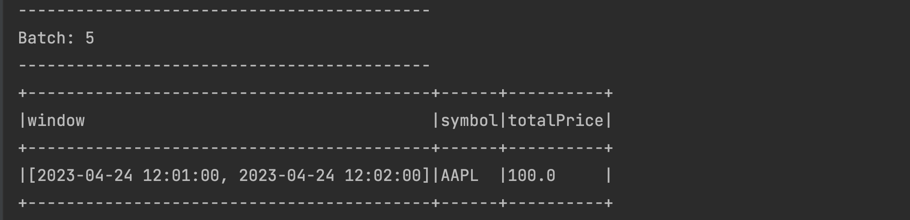
8. The previous time window **[2023-04-24 12:00:00, 2023-04-24 12:01:00]** is nicely preserved in the statestore, it is just not displayed above (this is a feature). To validate this, try sending some data to the previous window **2023-04-24 12:00:50,AAPL,100**. The previous window will now appear. This time the next window **[2023-04-24 12:01:00, 2023-04-24 12:02:00]** will be missing but that’s alright isn’t it?
   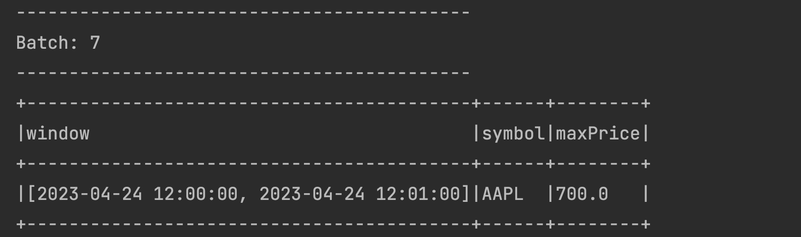
9. Late data is still being processed by our application. That is because the Event data has still not reached the Watermark boundary. The Watermark boundary is calculated using the following formula:

   - Max (Event Time) - Watermark = Watermark Boundary

   We can check if the Watermark Boundary has reached for the late data sent above. The time at which the latest event was sent is **12:01:10** (as per 2023-04-24 12:01:10,AAPL,100 record). So the calculation will be

   - 12:01:10 - 2 mins (120 seconds) = 11:59:10

   This means that all the windows ending before 11:59:10 will expire. The ending time window for our late data is 12:01:00 which is greater than the Watermark Boundary therefore the late date is processed by our application.

10. Let us now send the data that will create the new 3rd window **2023-04-24 12:03:10,AAPL,100** record. We should see a new window created for this data:
    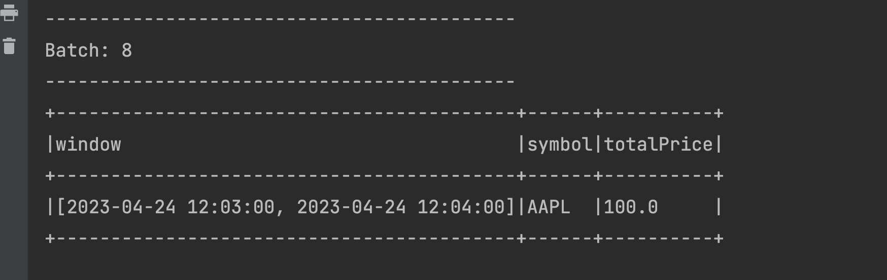
11. Calculate the Watermark boundary again:
    - 12:03:10 - 2 mins (120 seconds) = 12:01:10
12. The Watermark boundary comes as **12:01:10** as seen above. This is later than the end time window of our very first window which is **12:01:00**. This means if we send the late data again to the very first window, it should not be processed and also the data for that window should be dropped from the statestore. So let us send **2023-04-24 12:00:50,AAPL,100** again from our terminal. You should see the batch coming up empty as below. That is just Spark’s way of showing that the older window is dropped and that the watermark is working. :-)
    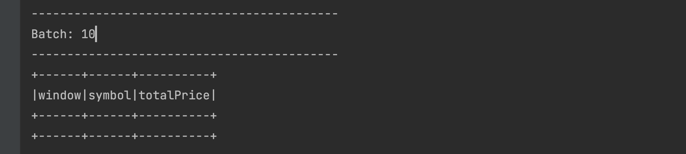

### Sliding Time Windows

While Tumbling Time Windows fit well with use cases that require static buckets, it is necessary to employ Sliding Time Windows for use cases that require more flexibility, like calculating an average for a 1 minute window every 15 seconds. Sliding Time windows are aptly named as they slide across a data stream, or move as time progresses. Unlike Tumbling Windows, Sliding Windows are overlapping windows and a single event can belong to more than 1 window.

A sample use case requiring the usage of Sliding Time Windows could be: calculate the maximum price of a stock symbol in a stock market application every 30 seconds in 1 minute windows. The previous implementation of Tumbling Windows will not work here because new windows are required to be generated every 30 seconds (and they must overlap).

We can see this Sliding Window in action:

1. Add a 3rd argument of `30 seconds` to the window declaration and also the aggregate function to max(price) as `MaximumPrice` as shown in the code below. (As in the previous example, you can find the complete code of this example [here](https://github.com/data-derp/exercise-vanilla-spark/blob/main/src/13%20-%20StreamingSlidingWindowWithWatermark.py)
   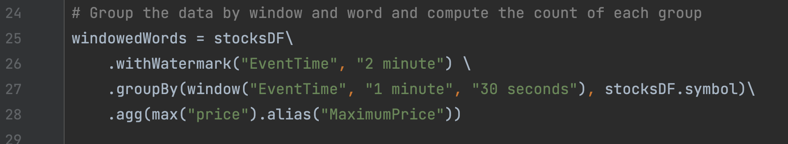
2. Let us now test this program with data streamed from the netcat application. Open a fresh terminal window and open netcat at port 9999 as shown below
   
3. Run the above program from Pycharm. Press Ctrl+Shift+R on your keyboard to run this. Alternatively, you can also open the program in Pycharm and press the execute button as shown below.
   
4. You should be able to see the first empty batch with `window`, `symbol` and `MaximumPrice` columns.
5. Let us start with sending the first event from netcat as **2023-04-24 12:05:15,AAPL,500**. The output can be seen below:
   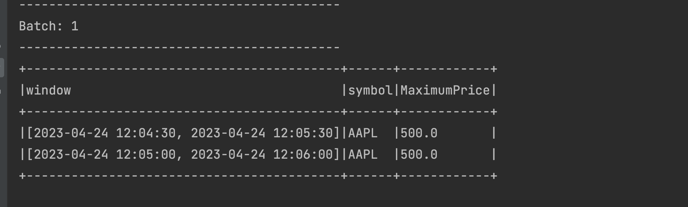
   Two time windows are displayed in the output. The event time of the streaming data is 12:05:15 so as expected, the window **[2023-04-24 12:05:00, 2023-04-24 12:06:00]** is displayed. Additionally, our event (streamed at 12:05:15) also is a member of the preceding and overlapping window **[2023-04-24 12:04:30, 2023-04-24 12:05:30]**. Because the window duration is 1 minute and the sliding time is 30 seconds, this event falls into two windows.

6. Let us send another data event from netcat as **2023-04-24 12:04:31,AAPL,450** and check the output below:
   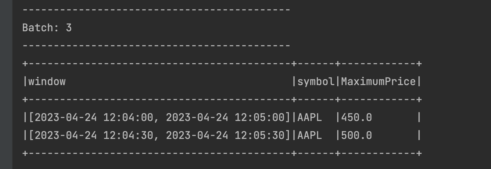
   The data was streamed at 12:04:31 with a price of 450. This is a member of the **[2023-04-24 12:04:30, 2023-04-24 12:05:30]** window. Now this window already had the MaximumPrice of 500 from the previous micro-batch. The resulting aggregated value under MaximumPrice remains at 500 because the existing value (500) is greater than the value of the event of the current microbatch (450).

   Since we have defined the `sliding time` as 30 seconds, the value (450) streamed at 12:04:31 also registers itself in the **[2023-04-24 12:04:00, 2023-04-24 12:05:00]** time window, which is why we also see that window in the above output.

   Let us take a moment now to summarize the total number of sliding windows we have in the state store as of

   |                   Window                   | Maximum Price | Persisted in statestore ? | Appears in the output ? |
   | :----------------------------------------: | :-----------: | :-----------------------: | :---------------------: |
   | [2023-04-24 12:04:00, 2023-04-24 12:05:00] |      450      |            Yes            |           Yes           |
   | [2023-04-24 12:04:30, 2023-04-24 12:05:30] |      500      |            Yes            |           Yes           |
   | [2023-04-24 12:05:00, 2023-04-24 12:06:00] |      500      |            Yes            |           No            |

7. Let us now send another data event from netcat as **2023-04-24 12:05:31,AAPL,460** and check the output below
   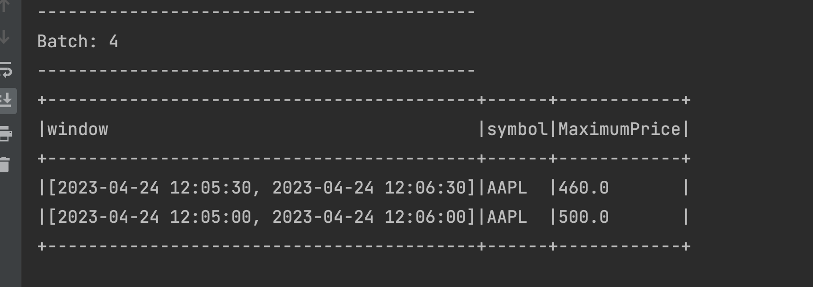

   The data was streamed at **12:05:31** with **460** as the price. This registers it under the **[2023-04-24 12:05:00, 2023-04-24 12:06:00]** window which already has the MaximumPrice of 500 from the previous micro-batch and because 500 is greater than 460, the MaximumPrice is remains at 500. This additionally validates that the window had been in the statestore from the previous micro-batch.

   Like the previous micro-batch, the event also registers itself in the **[2023-04-24 12:05:30, 2023-04-24 12:06:30]** time window, which is also displayed in the above output.

   In summary, we have 4 windows in statestore now as below

   |                   Window                   | Maximum Price | Persisted in statestore | Appears in the output |
   | :----------------------------------------: | :-----------: | :-----------------------: | :---------------------: |
   | [2023-04-24 12:04:00, 2023-04-24 12:05:00] |      450      |            True            |           False            |
   | [2023-04-24 12:04:30, 2023-04-24 12:05:30] |      500      |            True            |           False            |
   | [2023-04-24 12:05:00, 2023-04-24 12:06:00] |      500      |            True            |           True           |
   | [2023-04-24 12:05:30, 2023-04-24 12:06:30] |      460      |            True            |           True           |

8. Let’s send an event in the time range of the oldest window that we have in the statestore to prove that it still exists. Send a data event from netcat as **2023-04-24 12:04:32,AAPL,470** and check the output:
   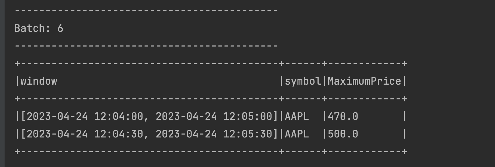

   We do indeed see the oldest window appearing with the MaximumPrice of 470 and we also see a second window. The 3rd and 4th windows are not displayed, but from previous experience, we know that they are still in the statestore !

You might have observed that all the data above 4 windows is saved in the statestore even though we have a Watermark declaration of 2 minutes. This is happening because the application has not yet not reached the Watermark Expiry Threshold as we have seen in the Tumbling Windows example.

### Sliding Time Windows with Watermarks

Similar to our Tumbling Windows example, we’ll also need to handle late data in Sliding Time Windows. Similarly, we’ll use Watermarks:

1. We’ll start from where we left off in the Sliding Window example:
   
   Note that the following 4 windows are in the statestore:

   | Window | Maximum Price                     | Persisted in statestore | Appears in the output |
   | :----------------------------------------: | :-----------: | :-----------------------: | :---------------------: |
   | [2023-04-24 12:04:00, 2023-04-24 12:05:00] | 470           | True                       | True                      |
   | [2023-04-24 12:04:30, 2023-04-24 12:05:30] | 500           | True                       | True                      |
   | [2023-04-24 12:05:00, 2023-04-24 12:06:00] | 500           | True                       | False                      |
   | [2023-04-24 12:05:30, 2023-04-24 12:06:30] | 460           | True                       | False                      |
2. Send a new event:  **2023-04-24 12:07:01,AAPL,480** and check the output:
   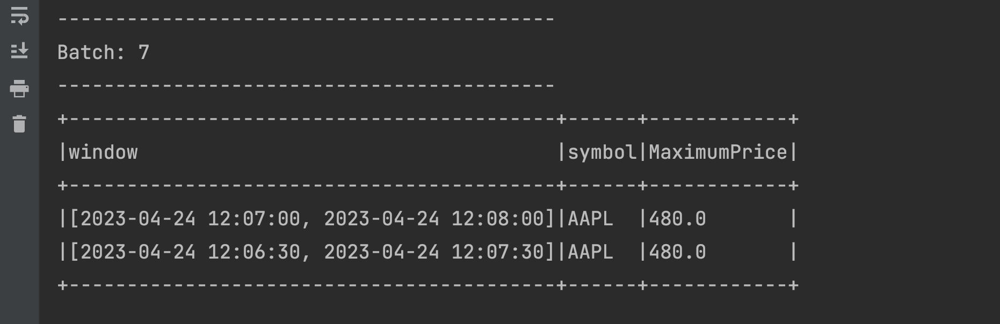
   There is nothing unexpected here. We have two new windows created making it a total of 6 active sliding windows:

   | Window | Maximum Price                     | Persisted in statestore | Appears in the output |
   | :----------------------------------------: | :-----------: | :-----------------------: | :---------------------: |
   | [2023-04-24 12:04:00, 2023-04-24 12:05:00] | 470           | True                       | False                      |
   | [2023-04-24 12:04:30, 2023-04-24 12:05:30] | 500           | True                       | False                      |
   | [2023-04-24 12:05:00, 2023-04-24 12:06:00] | 500           | True                       | False                      |
   | [2023-04-24 12:05:30, 2023-04-24 12:06:30] | 460           | True                       | False                      |
   | [2023-04-24 12:06:30, 2023-04-24 12:07:30] | 480           | True                       | True                     |
   | [2023-04-24 12:07:00, 2023-04-24 12:08:00] | 480           | True                       | True                     |

3. Send a new event **2023-04-24 12:04:33,AAPL,490** from the terminal. This should hypothetically register itself with  two windows in the statestore: **[2023-04-24 12:04:00, 2023-04-24 12:05:00]** and **[2023-04-24 12:04:30, 2023-04-24 12:05:30]**
   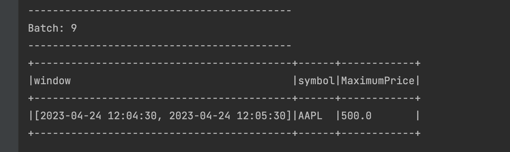
   However, we only see that it has registered itself with the second window (**[2023-04-24 12:04:30, 2023-04-24 12:05:30]**). When in doubt, check the Watermark Expiry Threshold, using the below formula:
   - Max (Event Time) - Watermark = Watermark Boundary

   The event time from the data sent in previous step is 12:07:01 (represents the max event time) so the calculation is represented as:
   - 12:07:01 - 2 minutes (Watermark) = 12:05:01

   Our current Watermark Expiry Threshold is therefore 12:05:01, which is later than the    end interval of our very first Window (**[2023-04-24 12:04:00, 2023-04-24 12:05:00]**), which in turn explains why our data was not registered against that window. In other words,  our very first window  expired and no additional data can be registered here (it is ignored). The data shown above is from our 2nd window (**[2023-04-24 12:04:30, 2023-04-24 12:05:30]**). This is within the Watermark Expiry Threshold;  therefore, the 2nd window is still active and exists in the statestore. The other 4 windows are also in the statestore but are simply not displayed.

### Conclusion
In this section, we’ve learned about how to aggregate data in both Tumbling and Sliding Time Windows which is used in situations where aggregations are made on [near] real-time data. We’ve additionally learned how to handle late data with both types of Windows, which is a very common and realistic occurrence, and under what circumstances data remains in the statestore.


