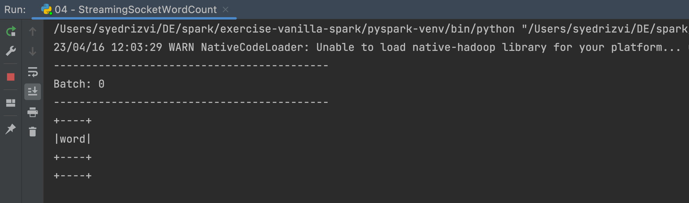
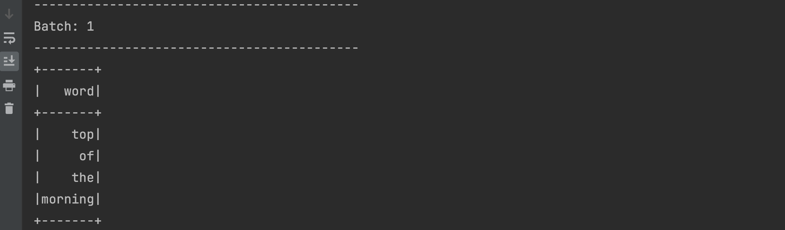
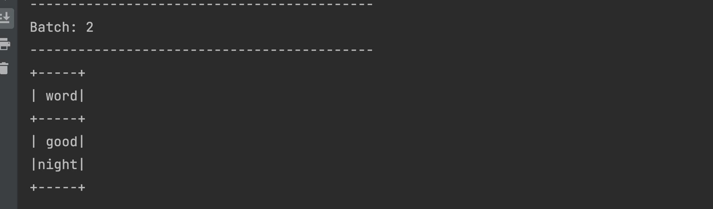
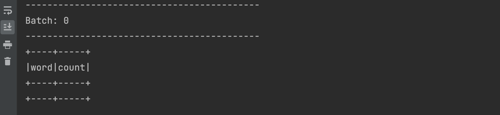
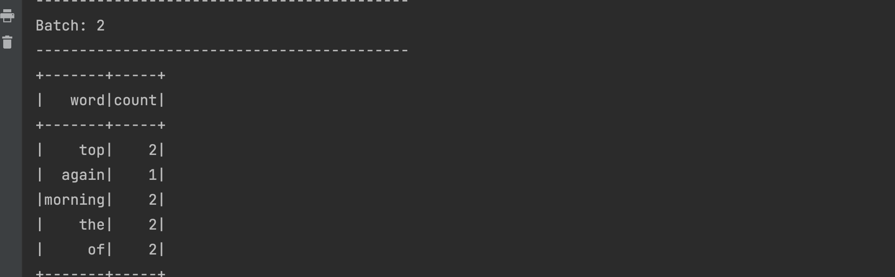

# Stateful vs. Stateless Streaming

There are two types of transformation that can be done in Spark Structured Streaming known as Stateless and Stateful transformation. Our code can have both and in fact both types of transformations can work in tandem with each other. Let us take a look at an example below :

```python showLineNumbers
from pyspark.sql import SparkSession
from pyspark.sql.functions import explode
from pyspark.sql.functions import split

spark = SparkSession \
    .builder \
    .appName("StructuredNetworkWordCount") \
    .getOrCreate()

spark.sparkContext.setLogLevel("ERROR")

# Create DataFrame representing the stream of input lines from connection to localhost:9999
# This acts like the source of data
lines = spark \
    .readStream \
    .format("socket") \
    .option("host", "localhost") \
    .option("port", 9999) \
    .load()
```

To start with, the above code creates a Spark object, sets up the log level, starts reading the data from a socket data source and stores the reference of the resulting streaming dataframe in a 'lines' variable.

Now let's add some transformation logic to this code as below:

```python showLineNumbers
# Split the lines into words
words = lines.select(
   explode(
       split(lines.value, " ")
   ).alias("word")
)
```

The code above 'lines' the dataframe created further above, uses 'explode' and 'split' transformations to create another dataframe with a single column called 'words'. The reference to this dataframe is saved in a 'words' variable.

Lastly, let add a writeStream code to the above program as below :

```python showLineNumbers
query = words \
    .writeStream \
    .outputMode("append") \
    .format("console") \
    .start()

query.awaitTermination()
```

As you can see above, the exploded and splitted data in the ‘words’ dataframe is further written to a writeStream. The output mode is 'append' and the output sink is 'console'. The thread is started in the last line with 'awaitTermination' operation. You can find this code and the instructions to set it up in Pycharm [here](https://github.com/data-derp/data-derp.github.io/blob/master/docs/data-engineering-the-good-parts/demo-vanilla-spark.mdx)

Now let's try and run this example with the below steps :

Note: the following examples use netcat. This is generally pre-installed; if it isn’t please follow the instructions to install it for [MacOS](https://nmap.org/download.html#macosx) and [Windows](https://nmap.org/download.html#windows).

1. Open a terminal in your machine and run 'nc -lk 9999' command. This will open a socket connection on your local machine at port 9999. You are now ready to send data to the above program as per the screenshot below
   
2. Run the above Spark Streaming code from pycharm. You will see an empty words dataframe in the output as below
   
3. Now send some data from terminal as below
   
4. You should be able to get that data in the output of running program in Pycharm
   
5. Try sending some more and different data from the terminal as below
   
6. Our program will output only the latest data with another run from the micro-batch as below
   

Everytime we send the data from the terminal, our Spark Streaming program is running a micro batch. When 'top of the morning' is sent from the terminal, it shows up in the output of our program. Likewise, when 'good night' is sent from the terminal, it shows up in the output as-is, with no reference or traces of the previous data. Why is this happening?

1. The 'explode' and 'split' transformations we are using in our program are stateless and hence they would not retain the data across multiple micro batches.
2. Additionally, our output mode is 'Append' when we are writing the data in the output sink. This output mode, as we have understood in the previous sections, is designed to process just the data in the current micro-batch, and then discards it.

So our program above is stateless right now. Let us turn this into stateful.

Add the following code just after the 'words' dataframe as below:

```python showLineNumbers
# Generate running word count
wordCounts = words.groupBy("word").count()

query = wordCounts \
    .writeStream \
    .outputMode("complete") \
    .format("console") \
    .start()

query.awaitTermination()
```

Note: To accurately write the 'wordCounts' dataframe to the output stream, you will have to change the name of the dataframe in the writeSteam code as shown above. Also the output mode is changed to 'Complete' since we have added the aggregation code.

Now let try running the latest updated example again as below:

1. Open a fresh terminal in your machine again and run ‘nc -lk 9999’ command.
   
2. Run the latest updated Spark Streaming code from pycharm. You will see an empty words dataframe with 'words' and 'counts' column as below
   
3. Let us try sending some data from the netcat terminal as below
   
4. You will see the data showing up in the output of pycharm program
   
5. Now try sending similar data with repeated words from the terminal as below
   
6. You should be see the repeated words being aggregated in the output as shown below
   

As you might have guessed, since we added the aggregation logic to our program and also changed the output mode, the data streamed from the netcat terminal is stored and aggregated across multiple micro-batches. This makes our program a stateful Spark Streaming application.
