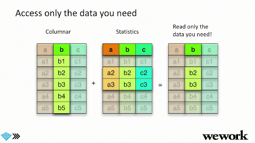

# Data Serialisation & Data Formats
## Wait...what’s data serialisation again?
(extracted from [Devopedia](https://devopedia.org/data-serialization))

* Data serialisation is the process of converting data objects present in complex data structures into a byte stream for storage, transfer and distribution purposes on physical devices.

* Computer systems may **vary** in their hardware architecture, OS, addressing mechanisms. Internal representations of data also vary accordingly in every environment/language. Storing and exchanging data between such varying environments requires a **platform-and-language-neutral data format** that all systems understand.

* Once the serialized data is transmitted from the source machine to the destination machine, the reverse process of creating objects from the byte sequence called **deserialisation** is carried out. Reconstructed objects are clones of the original object.

* Choice of data serialisation format for an application depends on factors such as data complexity, need for human readability, speed and storage space constraints.

## Data Formats
Data Serialisation and Data Formats go hand in hand because it describes how data is stored and then retrieved. Based on these patterns on storage and access, we might choose a specific file format to optimise those processes. There are a variety of file formats common to Data Engineering use cases - the classics include CSV, JSON, Avro, and Parquet (among others). There are other more modern data formats which we'll get to a little later.

A few important points to note before we dive into individual formats:
* Data on the hard disks is saved in blocks and gets loaded one at a time in memory.
* Reading unnecessary, fragmented and random data is expensive therefore sequential reads / writes are recommended.
* File formats determine the way that data is stored on the disk and is of different types for e.g Unstructured (Text, CSV, TSV etc), Semi-structured (jSON, XML etc) and Structured (Avro, Parquet etc).
* File formats stores data in a row oriented, column oriented or a hybrid format. Irrespective of the data orientation, the data is always arranged on the disk in sequential manner due the benefit of faster reads as mentioned above.
* Row-wise formats are best for write-heavy operations (OLTP workflows), Columnar are best for read-heavy (OLAP workflows) and Hybrid Formats try to provide the best of both worlds.

Some helpful vocabulary:
* **Splittable** = take one file and split it into multiple chunks (partitions) to allow for concurrent processing
* **Compressibility** = encoding a file using fewer bits than the original representation
* **Self-describing** = file contains both data and metadata (about the data, like the schema)
* **Schema evolution** = file can handle new columns and backwards-compatibility

### CSV
* Row-based and human-readable
* Compressible and splittable
* Faster writes but slower reads
* Flexible (as in, data can be easily changed, but can also be corrupted) but does not support schema evolution
* Best suited for smaller data sets which don't need any query time optimizations

### JSON
* Row-based and human-readable
* Compressible and splittable
* Faster writes but slower reads
* Self-describing
* Support complex data type like arrays and nested values
* Schema Evolution is not supported though column names are embedded inside the datasets
* Best suited for if the dataset has highly nested values which, like CSV, does not need query optimizations
* Suited for smaller data sets if used as a data exchange format

### Avro
* Row-based but not human-readable
* is itself a serialization format so it can be used for data exchange across the wire across different OS
* Self describing with support for Schema Evolution
* Binary format with Schema stored inside the file in JSON format
* Optimised for write-intensive applications
* Compressible and splittable
* Supports rich data structures like arrays and enumerated types
* Best suited for both realtime and batch workflows where fast data writes and transfer, schema validation and evolution is required.

### Parquet
* Columnar-based and not human-readable
* Self-describing
* Hybrid format where rows are grouped by row groups and then columns are partitioned
* Binary format like Avro with Schema stored inside the file in JSON format but does not support Schema Evolution
* Optimised for read intensive applications but performs well for write operations too due to its hybrid nature
* Compressible and splittable
* Support rich data structures like arrays and enumerated types, again like Avro
* Best suited for analytics workflow where fast query performance is needed

### Additional Resources (optional)
* [Big Data File Formats](https://luminousmen.com/post/big-data-file-formats)
* [Comparing the formats](https://www.datanami.com/2018/05/16/big-data-file-formats-demystified/#:~:text=The%20biggest%20difference%20between%20ORC,in%20a%20row%2Dbased%20format.&text=While%20column%2Doriented%20stores%20like,might%20be%20the%20better%20choice.)
* [Big Data File Showdown: Avro vs Parquet](https://www.confessionsofadataguy.com/big-data-file-showdown-avro-vs-parquet-with-python/)
* Avro is a [popular choice for streaming](https://www.confluent.io/blog/avro-kafka-data/) and persisting streaming data into data lakes (e.g. [Azure Event Hubs Capture](https://docs.microsoft.com/en-us/azure/event-hubs/event-hubs-capture-overview#exploring-the-captured-files-and-working-with-avro)).

    <figure class="video-container">
        <iframe width="560" height="315" src="https://www.youtube.com/embed/auNAzC3AU18?start=153" title="YouTube video player" frameborder="0" allow="accelerometer; autoplay; clipboard-write; encrypted-media; gyroscope; picture-in-picture" allowfullscreen="allowfullscreen"></iframe>
    </figure>
Big Data File Formats

<figure class="video-container">
    <iframe width="560" height="315" src="https://www.youtube.com/embed/1j8SdS7s_NY" title="YouTube video player" frameborder="0" allow="accelerometer; autoplay; clipboard-write; encrypted-media; gyroscope; picture-in-picture" allowfullscreen="allowfullscreen"></iframe>
</figure>

A Deeper Dive into Parquet + Performance Optimisation

## Check Your Learning!
Unlike MapReduce vs Spark, there’s no clear winner.
There’s always still a time and place for each of these formats!

| | CSV | JSON | Parquet | Avro |
| --- | --- | --- | --- | --- |
|Compressibility | :white_check_mark: | :white_check_mark: | :white_check_mark: | :white_check_mark: |
|Human Readability | :white_check_mark: | :white_check_mark: | | |
|Schema Evolution | | | | :white_check_mark: |
|Row or Columnar Storage | | | :white_check_mark: | :white_check_mark: |

## Bonus: Delta Lake
We'll cover Delta Lake in detail in the "Making Big Data Work" section, but let's define it here so you can keep an ear out for it. Delta Lake is an **open source** storage layer. It is similar to Parquet (some people refer to it as Parquet Plus) but it provides ACID transactions, time travel, the ability to remove data across various versions (vaccuuming), and you can stream and batch at the same time.
