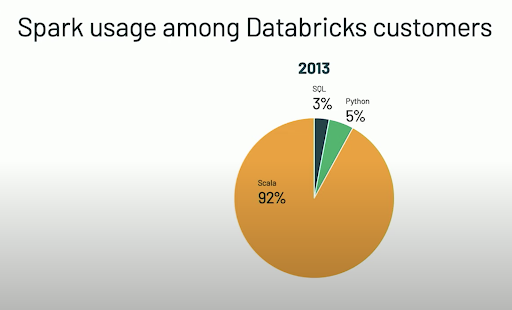

# Apache Spark Primer

## Introduction to Spark
**A Must-Read:** [Slides from Brooke Wenig](https://brookewenig.com/SparkOverview.html#/)

<figure class="video-container">
    <iframe width="560" height="315" src="https://www.youtube.com/embed/35Mjaa1YWTk" title="YouTube video player" frameborder="0" allow="accelerometer; autoplay; clipboard-write; encrypted-media; gyroscope; picture-in-picture" allowfullscreen="allowfullscreen"></iframe>
</figure>

Important comment upon Frank Kane’s video
  * Scala is only faster than Python if you’re writing a lot of custom UDFs or data structures with RDDs.
  If you’re using built-in Spark functions, then performance is **identical**.
  * Most modern Spark users are shifting towards a Python codebase to take advantage of modern data science and machine learning tools - see next slides for empirical evidence 😉.

Takeaways
  * What is the difference between Transformations (lazy evaluation) and Actions?
  * What is the difference between Driver and Worker nodes?

## Programming language popularity
Python has massively overtaken Scala in popularity for Spark.

For the exercises of this course we will use Python.
The APIs we will be using are:
  * Spark DataFrames
  * Pandas

 **Bonus Content:** [Spark SQL Programming Guide](http://spark.apache.org/docs/latest/sql-getting-started.html)

## Bonus Content: Data + AI Summit 2020
One of the keynote presentations from the Chief Architect of Databricks

<figure class="video-container">
    <iframe width="560" height="315" src="https://www.youtube.com/embed/-vJLTEOdLvA" title="YouTube video player" frameborder="0" allow="accelerometer; autoplay; clipboard-write; encrypted-media; gyroscope; picture-in-picture" allowfullscreen="allowfullscreen"></iframe>

Project Zen: Making Spark Pythonic | Reynold Xin | Keynote Data + AI Summit EU 2020
</figure>

* Heading towards taking advantage of idiomatic Python with type hints
* Improving Python debugging is on the Databricks roadmap
* There’s no denying the rich ecosystem of libraries, especially for advanced analytics & ML

