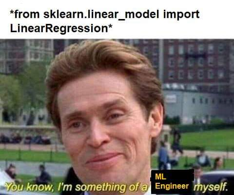

# Want to learn more? (Bonus)

There are plenty of Data Science and ML courses out there. A couple of examples: 

[Deep Learning Specialization - Andrew Ng](https://www.coursera.org/specializations/deep-learning)
Everybody loves it.

[fast.ai](https://www.fast.ai/)
Slightly more challenging + free
